# Attractor DOT Pipeline Schema

Version: 1.0.0
Date: 2026-02-19
PRD: PRD-S3-ATTRACTOR-001, Epic 2.1

This document defines the DOT vocabulary used by System 3 to model initiative
pipelines as executable Graphviz directed graphs. The vocabulary maps
Attractor-style node shapes and attributes to the harness domain (beads,
completion promises, validation agents, worker types).

---

## 1. Graph Envelope

Every pipeline is a `digraph` with a mandatory `pipeline` attribute block:

```dot
digraph "PRD-EXAMPLE-001" {
    // Pipeline metadata
    graph [
        label="Initiative: Example Feature"
        labelloc="t"
        fontsize=16
        rankdir="TB"
        prd_ref="PRD-EXAMPLE-001"
        promise_id=""              // Populated by attractor init-promise
    ];

    // Default node styling
    node [fontname="Helvetica" fontsize=11];
    edge [fontname="Helvetica" fontsize=9];

    // ... nodes and edges ...
}
```



### Required Graph Attributes

| Attribute | Type | Description |
|-----------|------|-------------|
| `prd_ref` | string | PRD identifier (e.g., `PRD-AUTH-001`) |
| `promise_id` | string | Completion promise ID (populated after `attractor init-promise`) |
| `label` | string | Human-readable initiative name |
| `rankdir` | `TB` or `LR` | Layout direction (top-bottom recommended) |

---

## 2. Node Shapes

Node shapes encode the handler type. Each shape maps to exactly one handler
category in the execution engine.

| Shape | DOT Syntax | Handler | Purpose |
|-------|-----------|---------|---------|
| Mdiamond | `shape=Mdiamond` | `start` | Pipeline entry point (PARSE stage) |
| Msquare | `shape=Msquare` | `exit` | Pipeline exit point (FINALIZE stage) |
| box | `shape=box` | `codergen` | Implementation task assigned to a worker |
| box | `shape=box` | `tool` | Tool execution step (CLI command, script) |
| hexagon | `shape=hexagon` | `wait.human` | Validation gate (technical or business) |
| diamond | `shape=diamond` | `conditional` | Routing decision based on upstream result |
| parallelogram | `shape=parallelogram` | `parallel` | Parallel execution group entry |

### Shape Selection Rules

1. Every graph MUST have exactly one `Mdiamond` (start) and one `Msquare` (exit).
2. Implementation work MUST use `box` with `handler=codergen`.
3. Tooling steps (scripts, CLI) MUST use `box` with `handler=tool`.
4. Every `codergen` node SHOULD have a paired `hexagon` validation gate.
5. Conditional routing MUST use `diamond` with labeled outbound edges.
6. Parallel fan-out SHOULD use `parallelogram` to group concurrent tasks.

---

## 3. Node Attributes

All custom attributes are placed inside the node's attribute list.

### Common Attributes (All Nodes)

| Attribute | Type | Required | Description |
|-----------|------|----------|-------------|
| `label` | string | Yes | Human-readable node name |
| `handler` | enum | Yes | Handler type: `start`, `exit`, `codergen`, `tool`, `wait.human`, `conditional`, `parallel` |
| `status` | enum | No | Current state: `pending`, `active`, `impl_complete`, `validated`, `failed` (default: `pending`) |

### Codergen Attributes (handler=codergen)

| Attribute | Type | Required | Description |
|-----------|------|----------|-------------|
| `bead_id` | string | Yes | Beads task ID (e.g., `TASK-123`) |
| `worker_type` | enum | Yes | Worker specialist: `frontend-dev-expert`, `backend-solutions-engineer`, `tdd-test-engineer`, `solution-architect` |
| `acceptance` | string | No | Inline acceptance criteria (short form) |
| `promise_ac` | string | No | Completion promise AC reference (e.g., `AC-1`) |
| `prd_ref` | string | No | Override graph-level PRD ref for this node |
| `files` | string | No | Comma-separated list of files to modify |

### Tool Attributes (handler=tool)

| Attribute | Type | Required | Description |
|-----------|------|----------|-------------|
| `command` | string | Yes | CLI command to execute |
| `timeout` | int | No | Timeout in seconds (default: 120) |

### Validation Gate Attributes (handler=wait.human)

| Attribute | Type | Required | Description |
|-----------|------|----------|-------------|
| `gate` | enum | Yes | Validation type: `technical`, `business`, `e2e`, `manual` |
| `mode` | enum | Yes | Maps to validation-agent mode: `technical`, `business` |
| `bead_id` | string | No | AT (Acceptance Test) beads task ID |
| `promise_ac` | string | No | Completion promise AC this gate validates |

### Conditional Attributes (handler=conditional)

| Attribute | Type | Required | Description |
|-----------|------|----------|-------------|
| `expression` | string | No | Condition expression to evaluate |

### Exit Attributes (handler=exit)

| Attribute | Type | Required | Description |
|-----------|------|----------|-------------|
| `promise_id` | string | No | Override graph-level promise for finalize |
| `promise_ac` | string | No | Final AC to verify at pipeline exit |

---

## 4. Edge Attributes

Edges connect nodes and encode dependencies, conditions, and labels.

| Attribute | Type | Required | Description |
|-----------|------|----------|-------------|
| `label` | string | No | Edge description displayed on graph |
| `condition` | string | Conditional | Required on edges leaving `diamond` nodes. Values: `pass`, `fail`, `partial`, or arbitrary expression |
| `style` | string | No | DOT edge style: `solid` (default), `dashed` (optional path), `bold` (critical path) |
| `color` | string | No | Visual encoding: `green` (pass path), `red` (fail path), `blue` (parallel) |

### Edge Rules

1. Edges from `diamond` nodes MUST have `condition` attributes.
2. Every `diamond` MUST have at least a `pass` and `fail` outbound edge.
3. Edges into `parallelogram` fan-in nodes use `style=bold`.
4. Retry edges (fail -> active) use `style=dashed color=red`.

---

## 5. Five-Stage Lifecycle

The pipeline maps to Attractor's 5-stage lifecycle. Each stage corresponds
to completion promise integration points.

```
  PARSE          VALIDATE       INITIALIZE       EXECUTE          FINALIZE
 [Mdiamond] --> [tool:validate] --> [tool:init] --> [codergen...] --> [Msquare]
     |               |                 |                |                |
     v               v                 v                v                v
  cs-init        attractor          cs-promise       cs-promise       cs-verify
  (create         validate          --start          --meet           --promise
   promise)      (structural       (activate         (per-AC          (triple
                  checks)           promise)          evidence)        gate)
```

### Stage Details

#### Stage 1: PARSE (Mdiamond)

The pipeline entry point. System 3 parses the PRD, generates tasks, creates
beads, and initializes the completion promise.

**Completion Promise Integration**:
```bash
# Initialize session
eval "$(cs-init --initiative login-feature)"

# Create promise with ACs derived from PRD
cs-promise --create "Login Feature" \
    --ac "Backend API endpoints return JWT tokens" \
    --ac "Frontend renders login form with validation" \
    --ac "E2E login flow works with real credentials"

# Start the promise
cs-promise --start <promise-id>
```

**Attractor DOT**:
```dot
start [shape=Mdiamond label="PARSE\nPRD-AUTH-001" handler=start];
```

#### Stage 2: VALIDATE (tool)

Validate the DOT graph structure: no cycles, all dependencies resolvable,
AT pairing complete, promise references valid.

**Completion Promise Integration**:
```bash
# Validate graph structure
attractor validate pipeline.dot

# Register graph validation as an AC
cs-promise --add-ac <promise-id> "Pipeline graph validated (no structural errors)"
```

**Attractor DOT**:
```dot
validate [shape=box label="Validate Graph" handler=tool
          command="attractor validate pipeline.dot"];
```

#### Stage 3: INITIALIZE (tool)

Prepare execution environment: create worktrees, spawn teams, start services.

**Completion Promise Integration**:
```bash
# Register environment readiness AC
cs-promise --add-ac <promise-id> "Execution environment ready (worktrees, teams, services)"
```

**Attractor DOT**:
```dot
init_env [shape=box label="Initialize\nEnvironment" handler=tool
          command="launchorchestrator login-feature"];
```

#### Stage 4: EXECUTE (codergen + wait.human)

Workers implement tasks. Each task has a codergen node (implementation) paired
with a hexagon node (validation gate). As tasks complete, ACs are met.

**Completion Promise Integration**:
```bash
# As each task completes, submit evidence per AC
cs-promise --meet <promise-id> --ac-id AC-1 \
    --evidence "POST /auth/login returns 200 with JWT" --type api

cs-promise --meet <promise-id> --ac-id AC-2 \
    --evidence "Login form renders, client-side validation passes" --type test
```

**Attractor DOT**:
```dot
impl_backend [shape=box label="Implement Backend API" handler=codergen
              bead_id="TASK-10" worker_type="backend-solutions-engineer"
              promise_ac="AC-1"];

validate_backend [shape=hexagon label="Validate Backend\n(technical)" handler="wait.human"
                  gate=technical mode=technical bead_id="AT-10"];

impl_backend -> validate_backend;
```

#### Stage 5: FINALIZE (Msquare)

All tasks validated, evidence collected, completion promise verified through
the triple gate (Gate 1: all ACs met, Gate 2: validation responses stored,
Gate 3: Agent SDK independent verification).

**Completion Promise Integration**:
```bash
# Triple-gate verification
cs-verify --promise <promise-id> --type e2e --proof "All 3 ACs met with evidence"
```

**Attractor DOT**:
```dot
finalize [shape=Msquare label="FINALIZE\nTriple Gate" handler=exit
          promise_id="promise-abc123" promise_ac="AC-3"];
```

---

## 6. Status Transitions

Nodes progress through a defined status lifecycle. The status attribute on
each node tracks its current state.

```
                          +---------+
                          |         |
                          v         |
pending --> active --> impl_complete --> validated
                          |
                          v
                        failed --> active  (retry)
```

### Transition Rules

| From | To | Trigger | Who |
|------|----|---------|-----|
| `pending` | `active` | Orchestrator assigns worker | Orchestrator |
| `active` | `impl_complete` | Worker reports done | Orchestrator (`bd update --status=impl_complete`) |
| `impl_complete` | `validated` | Validation gate passes (both technical + business) | System 3 (`attractor transition`) |
| `impl_complete` | `failed` | Validation gate rejects | System 3 (`attractor transition`) |
| `failed` | `active` | System 3 returns to orchestrator with feedback | System 3 |
| `validated` | (terminal) | Node complete, evidence stored | -- |

### Status Colors (for DOT rendering)

| Status | Color | Style |
|--------|-------|-------|
| `pending` | `gray` | `style=filled fillcolor=lightyellow` |
| `active` | `blue` | `style=filled fillcolor=lightblue` |
| `impl_complete` | `orange` | `style=filled fillcolor=lightsalmon` |
| `validated` | `green` | `style=filled fillcolor=lightgreen` |
| `failed` | `red` | `style=filled fillcolor=lightcoral` |

---

## 7. AT (Acceptance Test) Pairing Convention

Every `codergen` node SHOULD have a paired validation `hexagon` node. This
maps to the Dual Closure Gate architecture where implementation and
validation are independently executed.

### Naming Convention

| Implementation Node | Validation Node (Technical) | Validation Node (Business) |
|--------------------|----|----|
| `impl_backend` | `validate_backend_tech` | `validate_backend_biz` |
| `impl_frontend` | `validate_frontend_tech` | `validate_frontend_biz` |

### Dual-Mode Validation

Each implementation node can have TWO validation gates (matching Epic 1.3
dual-mode validation):

```dot
// Implementation
impl_backend [shape=box handler=codergen bead_id="TASK-10"
              worker_type="backend-solutions-engineer" promise_ac="AC-1"];

// Technical validation (runs first)
validate_backend_tech [shape=hexagon handler="wait.human"
                       gate=technical mode=technical bead_id="AT-10-TECH"];

// Business validation (runs second)
validate_backend_biz [shape=hexagon handler="wait.human"
                      gate=business mode=business bead_id="AT-10-BIZ"];

// Edges: sequential dual-pass
impl_backend -> validate_backend_tech;
validate_backend_tech -> validate_backend_biz;
```

---

## 8. Conditional Routing

Diamond nodes route the pipeline based on validation outcomes.

```dot
decision_backend [shape=diamond label="Backend\nValidation?" handler=conditional];

validate_backend_biz -> decision_backend;

decision_backend -> impl_frontend [label="pass" condition=pass color=green];
decision_backend -> impl_backend  [label="fail\nretry" condition=fail
                                   color=red style=dashed];
```

### Standard Condition Values

| Condition | Meaning | Typical Edge Target |
|-----------|---------|---------------------|
| `pass` | All validations passed | Next pipeline stage |
| `fail` | Validation rejected | Retry node (back to implementation) or fail exit |
| `partial` | Some criteria met | Conditional continuation with caveats |

---

## 9. Parallel Execution

Parallelogram nodes group concurrent work streams. Use Graphviz `subgraph`
for visual grouping and `parallelogram` as the fan-in/fan-out marker.

```dot
parallel_start [shape=parallelogram label="Parallel:\nBackend + Frontend" handler=parallel];

parallel_start -> impl_backend;
parallel_start -> impl_frontend;

// Fan-in at validation
validate_backend_biz -> join_validation;
validate_frontend_biz -> join_validation;

join_validation [shape=parallelogram label="Join:\nAll Validated" handler=parallel];
```

---

## 10. Completion Promise Integration Summary

The pipeline graph and completion promise system are tightly coupled:

| Pipeline Event | Promise Command | Purpose |
|---------------|-----------------|---------|
| Graph created from PRD | `cs-init` + `cs-promise --create` | Initialize promise with PRD-derived ACs |
| Graph validated | `cs-promise --add-ac` | Register graph validation as AC |
| Environment ready | `cs-promise --add-ac` | Register env readiness as AC |
| Task impl_complete | `cs-promise --meet --ac-id` | Submit per-criterion evidence |
| Validation gate passes | `cs-store-validation` | Store validation response for Gate 2 |
| All nodes validated | `cs-verify --promise` | Triple-gate: Gate 1 (ACs) + Gate 2 (validations) + Gate 3 (Agent SDK) |
| Pipeline finalized | Promise moved to history | Session can end (stop hook passes) |

---

## 11. Structural Validation Rules

The `attractor validate` command enforces these rules:

1. **Single entry**: Exactly one `Mdiamond` node.
2. **Single exit**: Exactly one `Msquare` node.
3. **Reachability**: All nodes reachable from start.
4. **No orphans**: No nodes disconnected from the graph.
5. **AT pairing**: Every `codergen` node has at least one `hexagon` descendant.
6. **Bead references**: Every `codergen` node has a non-empty `bead_id`.
7. **Conditional completeness**: Every `diamond` has both `pass` and `fail` outbound edges.
8. **Promise coherence**: If `promise_id` set on graph, all `promise_ac` values reference valid ACs.
9. **No unguarded cycles**: Cycles only via `diamond` fail-edges (retry paths).
10. **Handler consistency**: Node `shape` matches declared `handler`.

---

## 12. File Conventions

| Path | Description |
|------|-------------|
| `.claude/attractor/schema.md` | This document |
| `.claude/attractor/examples/*.dot` | Example pipeline DOT files |
| `.claude/attractor/pipelines/*.dot` | Active pipeline DOT files (per initiative) |
| `.claude/attractor/state/*.json` | Runtime state checkpoints |
| `.claude/scripts/attractor/` | CLI tools (parse, validate, status, transition, checkpoint) |
