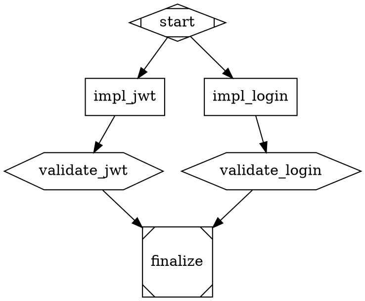

# Claude Harness: A 4-Layer Autonomous Agent Execution Framework

> Architecture overview for article and diagram creation.
> Based on the Claude Code Harness Setup — an open orchestration framework
> for building production genAI applications with Claude Code.

---

## The Problem

Modern AI coding agents are powerful but unreliable at scale. When you ask Claude Code to build a multi-service application — authentication, real-time sync, validation pipelines — you hit three fundamental problems:

1. **No persistent goals.** Sessions end, context is lost, promises are forgotten.
2. **Self-grading.** The agent that writes the code also decides if it's done. There's no independent check.
3. **Flat coordination.** A single agent trying to build frontend, backend, tests, and infrastructure simultaneously produces fragmented, inconsistent work.

The Claude Harness solves these with a biologically-inspired 4-layer architecture where each layer has a single responsibility — and the layer that validates the work never sees the answers in advance.

---

## Architecture: 4 Layers of Autonomous Execution

```
Layer 0 ─ Terminal (User / System 3 Meta-Orchestrator)
    │
    │  DOT pipeline + completion promises
    │
Layer 1 ─ Guardian (Independent Validator)
    │
    │  atomic JSON signals
    │
Layer 2 ─ Runner (SDK Monitor Agent)
    │
    │  tmux capture + relay
    │
Layer 3 ─ Orchestrator → Workers (Implementation)
```

Each layer is a separate Claude Code process. They communicate through atomic JSON signal files — no shared memory, no race conditions, no trust assumptions.

### Layer 0: The Terminal (Strategic Command)

The Terminal is either a human operator or System 3, our meta-orchestrator. It sets the goal, creates a completion promise, and defines the execution plan as a DOT directed graph.

**Completion Promises** are UUID-tracked commitments that bind a session to verifiable outcomes:

```
User Goal: "Build authentication with JWT, login UI, and session management"
     │
     ▼
Completion Promise (UUID: a7f3b9e1)
  ├── AC-1: JWT validation endpoint returns 200 for valid tokens
  ├── AC-2: Login form submits credentials and receives session cookie
  └── AC-3: Session expires after 30 minutes of inactivity
     │
     ▼
Status: pending → in_progress → verified
```

The session cannot stop until every acceptance criterion has evidence attached. This is enforced by a stop hook — the agent literally cannot exit. No hand-waving, no "I think it's done." Show the proof or keep working.

**DOT Pipeline Graphs** encode the execution plan as a directed acyclic graph:



Every task node carries its bead ID (issue tracker reference), worker type, acceptance criteria, and current status. The graph is both the execution plan and the live dashboard — statuses are updated in-place as work progresses.

### Layer 1: The Guardian (Independent Validation)

The Guardian is the architectural innovation that makes the system trustworthy.

When a pipeline starts, the Guardian does something the orchestrators never see: it reads the PRD and creates **blind acceptance tests** — Gherkin scenarios stored in a config repository that the implementation agents have no access to.

```
acceptance-tests/PRD-AUTH-001/
├── manifest.yaml              # Feature weights and thresholds
├── AC-jwt-validation.yaml     # Gherkin: token format, expiry, refresh
├── AC-login-flow.yaml         # Gherkin: form submission, error states
└── AC-session-management.yaml # Gherkin: timeout, renewal, revocation
```

The Guardian then launches the orchestrator (via the Runner), monitors progress through signals, and — crucially — validates the finished work by reading the actual code against its blind rubric. Each scenario gets a confidence score (0.0 to 1.0). The weighted total determines pass/fail.

**Guardian Disposition: Skeptical Curiosity**

The Guardian is not a rubber stamp. It operates with a specific mindset:

- **Never trust self-reported success.** Orchestrators naturally over-report progress. Read the actual code, run the actual tests.
- **Question surface explanations.** "Blocked by X" gets independently verified. Is X truly the blocker? Can X be resolved?
- **Push for completion.** When the team says "let's skip E2E and merge as-is," the Guardian asks: is the blocker actually a 1-line fix?

This disposition propagates down through the layers, creating a culture of thoroughness.

### Layer 2: The Runner (Unbiased Monitor)

The Runner is a separate Claude Code SDK agent whose sole job is observation. It monitors the orchestrator's tmux session, captures output at regular intervals, and interprets what it sees using AI intelligence — not brittle regex patterns.

The Runner detects five categories of events:

| Signal | Trigger | Guardian Action |
|--------|---------|-----------------|
| `NEEDS_REVIEW` | Implementation appears complete | Validate against blind rubric |
| `NEEDS_INPUT` | Orchestrator needs a decision | Guardian decides (it's the "user" for Layer 3) |
| `VIOLATION` | Orchestrator editing files directly | Warn or kill, depending on severity |
| `ORCHESTRATOR_STUCK` | No progress for N minutes | Send targeted guidance |
| `ORCHESTRATOR_CRASHED` | tmux session died | Retry or escalate |

Signals are atomic JSON files written with rename-on-close semantics — no partial reads, no corruption, no race conditions:

```json
{
  "source": "runner",
  "target": "guardian",
  "signal_type": "NEEDS_REVIEW",
  "timestamp": "20260224T143052Z",
  "payload": {
    "node_id": "impl_jwt",
    "commit": "a1b2c3d",
    "summary": "JWT validation endpoint with RS256 support, 47 tests passing"
  }
}
```

### Layer 3: Orchestrator + Workers (Implementation)

The Orchestrator runs interactively in an isolated tmux session with its own git worktree. It never writes code directly — it coordinates a team of specialist workers:

| Worker Type | Specialty |
|-------------|-----------|
| `frontend-dev-expert` | React, Next.js, TypeScript, Tailwind |
| `backend-solutions-engineer` | Python, FastAPI, PydanticAI, databases |
| `tdd-test-engineer` | Unit tests, E2E browser testing, pytest |
| `solution-design-architect` | PRDs, design documents, architecture |

Workers are spawned as native Claude Code teammates that claim tasks from a shared task list, implement them, and report completion. The Orchestrator validates unit tests pass, then marks the task `impl_complete` — handing control back up through the signal chain for independent validation.

**The key insight**: the Orchestrator marks work as "implementation complete," but it does NOT mark it as "done." Only the Guardian — after independent validation against the blind rubric — can close a task.

---

## The Execution Loop

Here's the full lifecycle of a single pipeline node:

```
                    Layer 0 (Terminal)
                         │
                    Creates DOT graph with
                    target_dir, bead IDs, ACs
                         │
                         ▼
                    Layer 1 (Guardian)
               ┌─────────────────────────┐
               │ 1. Parse DOT pipeline    │
               │ 2. Create blind tests    │
               │ 3. Find ready nodes      │
               │    (pending + deps met)  │
               │ 4. Transition → active   │
               │ 5. Spawn Runner          │
               └────────────┬────────────┘
                            │
                            ▼
                    Layer 2 (Runner)
               ┌─────────────────────────┐
               │ 1. Spawn Orchestrator    │
               │    in tmux + worktree    │
               │ 2. Monitor loop:         │
               │    capture → interpret   │
               │    → detect events       │
               │ 3. On completion:        │
               │    signal NEEDS_REVIEW   │
               └────────────┬────────────┘
                            │
                   signal: NEEDS_REVIEW
                            │
                            ▼
                    Layer 1 (Guardian)
               ┌─────────────────────────┐
               │ 1. Read blind rubric     │
               │ 2. Read actual code      │
               │    from impl repo        │
               │ 3. Score each scenario   │
               │    (0.0 → 1.0)           │
               │ 4. Compute weighted total│
               │ 5. Decision:             │
               │    ≥ 0.60 → PASSED       │
               │    ≤ 0.40 → FAILED       │
               │    between → INVESTIGATE │
               └────────────┬────────────┘
                            │
              signal: VALIDATION_PASSED
              (or VALIDATION_FAILED + feedback)
                            │
                            ▼
                    Layer 2 (Runner)
               ┌─────────────────────────┐
               │ Relay to Orchestrator    │
               │ via tmux send-keys       │
               │                          │
               │ If PASSED: exit          │
               │ If FAILED: relay         │
               │   feedback, continue     │
               │   monitoring             │
               └─────────────────────────┘
                            │
                            ▼
                    Layer 1 (Guardian)
               ┌─────────────────────────┐
               │ Transition node:         │
               │   → impl_complete        │
               │   → validated            │
               │ Checkpoint pipeline      │
               │ Find next ready node     │
               │ Loop until all validated │
               └────────────┬────────────┘
                            │
                  All nodes validated
                            │
                            ▼
                    Layer 0 (Terminal)
               ┌─────────────────────────┐
               │ Verify completion promise│
               │ All ACs have evidence    │
               │ Session may now end      │
               └─────────────────────────┘
```

---

## Beads: Work Tracking That Survives Context Loss

Every task in the system is tracked as a **bead** — a lightweight issue with dependencies, status, and acceptance criteria. Beads live in a `.beads/` directory managed by git, making them fully persistent and sharable across sessions.

```bash
bd create --title="JWT validation endpoint" --type=task --priority=1
# Returns: AUTH-001

bd update AUTH-001 --status=in_progress
# ... implementation happens ...
bd update AUTH-001 --status=impl_complete
# ... guardian validates ...
bd close AUTH-001 --reason="Validated: 0.87 confidence, all scenarios pass"
```

Beads map directly to DOT pipeline nodes via `bead_id` attributes. The pipeline graph is the execution plan; beads are the issue tracker. Together they provide both the "what to do" (graph structure + node dependencies) and the "what happened" (bead status + closure evidence).

**Dependency types** enable sophisticated work coordination:

| Type | Purpose | Blocks `bd ready`? |
|------|---------|---------------------|
| `blocks` | Sequential requirement | Yes |
| `parent-child` | Organizational grouping | No |
| `related` | Soft reference | No |

---

## The Blind Validation Pattern

This is the core innovation. In traditional CI/CD, the same team that writes the code also writes the tests. In the Claude Harness, the Guardian creates acceptance tests from the PRD before any implementation begins — and stores them in a repository the implementers cannot access.

```
                Config Repo (Guardian access only)
                ┌─────────────────────────────────┐
                │ acceptance-tests/PRD-AUTH-001/   │
                │ ├── manifest.yaml               │
                │ ├── AC-jwt-validation.yaml      │
                │ └── AC-session-management.yaml  │
                └──────────────┬──────────────────┘
                               │
                    Guardian reads rubric
                    Guardian reads impl code
                               │
                               ▼
                    Score: 0.87 → PASSED
                ┌─────────────────────────────────┐
                │ .claude/evidence/AUTH-001/       │
                │ ├── validation-report.json       │
                │ ├── scenario-scores.json         │
                │ └── code-snippets.json           │
                └─────────────────────────────────┘


                Impl Repo (Orchestrator + Workers)
                ┌─────────────────────────────────┐
                │ src/auth/jwt.py                  │
                │ src/auth/session.py              │
                │ tests/test_jwt.py                │
                │ (NO access to acceptance-tests/) │
                └─────────────────────────────────┘
```

This separation means:
- Workers can't teach to the test
- The Guardian's assessment is genuinely independent
- Confidence scores reflect real implementation quality, not test-writing skill

---

## Signal Protocol: The Nervous System

All inter-layer communication uses atomic JSON signal files. No databases, no message queues, no network services — just the filesystem with rename-on-close atomicity.

```
.claude/attractor/signals/
├── 20260224T143052Z-runner-guardian-NEEDS_REVIEW.json
├── 20260224T143120Z-guardian-runner-VALIDATION_PASSED.json
├── processed/
│   └── (consumed signals move here)
```

**Why files instead of a message queue?**

1. **Zero infrastructure.** No Redis, no RabbitMQ, no Docker. Just the filesystem.
2. **Crash-safe.** Files are atomic (write-then-rename). No partial reads.
3. **Observable.** `ls` the signals directory to see what's happening. `cat` any signal to debug.
4. **Git-friendly.** Signal history is audit trail.

Each signal has: `source` (who sent it), `target` (who should read it), `signal_type` (what happened), `timestamp`, and `payload` (structured data).

---

## Completion Promises: Sessions That Keep Their Word

The stop hook is the enforcement mechanism that makes everything work. A System 3 session creates a completion promise at the start:

```bash
cs-promise --create "Build JWT auth system" \
  --ac "JWT endpoint validates RS256 tokens" \
  --ac "Login form submits to /api/auth" \
  --ac "Sessions expire after 30 minutes"
```

As work completes, evidence is attached to each criterion:

```bash
cs-promise --meet $PROMISE_ID --ac-id AC-1 \
  --evidence "47 tests pass, endpoint returns 200 for valid RS256 tokens" \
  --type test
```

When the agent tries to stop, the stop hook checks:
1. Are there pending promises? **Block.**
2. Are there unverified acceptance criteria? **Block.**
3. Is there actionable work in `bd ready`? **Block.**
4. All verified? **Allow stop.**

This creates a self-sustaining loop: the agent literally cannot exit until the user's goals are met. It's not a suggestion or a convention — it's a programmatic constraint.

---

## DOT Pipeline Navigation: The Execution Brain

The Attractor CLI manages pipeline lifecycle through a simple state machine:

```
pending → active → impl_complete → validated
                                  ↘ failed → active (retry)
```

Key operations:

```bash
# Find what's ready to work on (pending + all upstream deps met)
cli.py status pipeline.dot --filter=pending --deps-met --json

# Advance a node
cli.py transition pipeline.dot impl_jwt active
cli.py transition pipeline.dot impl_jwt impl_complete
cli.py transition pipeline.dot impl_jwt validated

# Checkpoint after every transition (enables rollback)
cli.py checkpoint save pipeline.dot

# Full pipeline status
cli.py status pipeline.dot --summary
```

The Guardian reads the graph, finds dispatchable nodes, transitions them to active, spawns runners, and advances them through the lifecycle. When all codergen nodes reach `validated`, the pipeline is complete.

Pipeline graphs support a `target_dir` attribute that propagates through the entire chain — Guardian reads it from the DOT file, passes it to the Runner, which passes it to the Orchestrator, which runs in the correct implementation repository directory. One graph attribute, four layers of correct configuration.

---

## Putting It Together: From Goal to Validated Software

```
┌──────────────────────────────────────────────────────────────────┐
│                                                                  │
│  1. User states goal                                             │
│     "Build authentication with JWT, login UI, session mgmt"     │
│                                                                  │
│  2. System 3 creates:                                            │
│     ├── Completion promise (UUID, 3 acceptance criteria)        │
│     ├── Beads (AUTH-001, AUTH-002, AUTH-003)                    │
│     └── DOT pipeline (3 codergen + 3 validation nodes)         │
│                                                                  │
│  3. Guardian creates blind acceptance tests from PRD             │
│     └── Stored in config repo (impl agents can't see them)     │
│                                                                  │
│  4. Guardian dispatches first ready node:                        │
│     └── Spawns Runner → Runner spawns Orchestrator in tmux     │
│         └── Orchestrator delegates to backend worker            │
│             └── Worker implements JWT endpoint, writes tests    │
│                                                                  │
│  5. Runner detects completion, signals NEEDS_REVIEW             │
│                                                                  │
│  6. Guardian independently validates:                            │
│     ├── Reads blind rubric (AC-jwt-validation.yaml)            │
│     ├── Reads actual code (src/auth/jwt.py)                    │
│     ├── Scores scenarios (0.0-1.0 each)                        │
│     └── Weighted total: 0.87 → VALIDATION_PASSED               │
│                                                                  │
│  7. Guardian transitions node → validated                        │
│     Dispatches next ready node (login UI → frontend worker)    │
│                                                                  │
│  8. Repeat steps 4-7 for all nodes                              │
│                                                                  │
│  9. All nodes validated → Pipeline complete                      │
│     ├── Guardian verifies completion promise                    │
│     ├── Evidence attached to all acceptance criteria            │
│     └── Session allowed to end                                  │
│                                                                  │
└──────────────────────────────────────────────────────────────────┘
```

---

## Key Design Decisions

### Why 4 Layers Instead of 1?

A single agent that plans, implements, tests, and validates its own work will always have a conflict of interest. The 4-layer design creates separation of concerns:

- **Layer 0** sets the goal and measures success (the "what")
- **Layer 1** validates independently with blind criteria (the "is it right?")
- **Layer 2** monitors without bias (the "is it progressing?")
- **Layer 3** implements without distraction (the "how")

### Why DOT Graphs?

DOT is a simple, human-readable, widely-supported format. Pipeline graphs are:
- **Inspectable** — open in any text editor or visualize with Graphviz
- **Diffable** — git tracks every status change
- **Declarative** — the graph describes what needs to happen, not how
- **Extensible** — custom attributes (bead_id, worker_type, acceptance) ride on standard DOT syntax

### Why File-Based Signals?

The simplest thing that works. Files are atomic, observable, crash-safe, and require zero infrastructure. When debugging, you `ls` and `cat`. When auditing, you `git log`. When scaling, you add more files.

### Why Blind Validation?

In software testing, the gold standard is independent verification — the person who checks the work should not be the person who did the work. The Guardian pattern extends this to AI agents: the validator creates its rubric before implementation begins and never shares it with the implementers.

---

## Tech Stack

| Component | Technology |
|-----------|-----------|
| Agent Runtime | Claude Code (Anthropic) |
| Agent SDK | `claude_code_sdk` (Python async) |
| Pipeline Format | DOT (Graphviz) |
| Issue Tracking | Beads (`.beads/` git-native) |
| Signal Protocol | Atomic JSON files |
| Process Isolation | tmux sessions + git worktrees |
| Session Tracking | Completion promises (UUID-based JSON) |
| Long-Term Memory | Hindsight MCP (4 memory networks) |
| CLI Tools | Python (attractor CLI, completion-state CLI) |
| Worker Coordination | Claude Code native Agent Teams |

---

## Diagram Guide

For creating a visual diagram, the key elements are:

### Boxes (Layers)
- **Layer 0**: Terminal / System 3 — gold/yellow
- **Layer 1**: Guardian — green (independent, trusted)
- **Layer 2**: Runner — blue (observer, unbiased)
- **Layer 3**: Orchestrator + Workers — orange (implementation)

### Arrows (Communication)
- **Downward**: DOT graph dispatch, orchestrator spawn commands
- **Upward**: JSON signals (NEEDS_REVIEW, NEEDS_INPUT, VIOLATION)
- **Lateral**: Worker coordination within Layer 3 (native teams)

### Artifacts
- **DOT Pipeline** (diamond): connects Layer 0 to Layer 1
- **Blind Tests** (shield icon): Layer 1 only, invisible to Layer 3
- **Beads** (circle chain): shared across all layers for status tracking
- **Signals** (lightning bolt): between Layer 1 and Layer 2
- **tmux** (terminal icon): Layer 2 monitoring Layer 3

### Key Callouts
1. "Blind rubric created BEFORE implementation" (between Guardian and acceptance-tests)
2. "Orchestrator never sees acceptance tests" (between Layer 3 and the shield)
3. "Session cannot exit until all ACs verified" (at the stop hook)
4. "File-based signals — zero infrastructure" (at the signal arrows)

---

## Repository

The Claude Code Harness Setup is the configuration framework that powers this architecture. It contains no application code — only the orchestration tools, skills, hooks, and pipeline management infrastructure that can be copied into any project repository.

**Key directories**:
- `.claude/scripts/attractor/` — Guardian, Runner, signal protocol, CLI
- `.claude/skills/s3-guardian/` — Guardian skill with blind validation pattern
- `.claude/skills/system3-orchestrator/` — System 3 meta-orchestration
- `.claude/skills/orchestrator-multiagent/` — Worker coordination patterns
- `.claude/scripts/completion-state/` — Promise tracking CLI

---

*Built with Claude Code by Anthropic. The harness is framework-agnostic — it orchestrates any codebase where Claude Code can run.*
