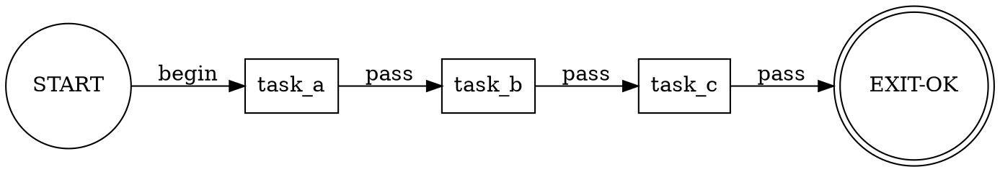

# DOT Node-Driven Validation Scoring

This document defines how DOT pipeline graphs are scored for validation purposes. Scoring operates at two levels: **per-node** and **graph-level**.

## Overview

Every node in a DOT pipeline carries a `status` attribute. The validation scorer reads the graph, aggregates node statuses, and produces a normalised score in `[0.0, 1.0]`.

```
Graph Score = Σ(node_weight × node_score) / Σ(node_weight)
```

## Node Statuses and Score Values

| Status | Score | Meaning |
|--------|-------|---------|
| `done` | 1.0 | Node completed and validated |
| `pass` | 1.0 | Acceptance criteria met |
| `partial` | 0.5 | Some criteria met, work remaining |
| `in_progress` | 0.25 | Work started but incomplete |
| `pending` | 0.0 | Not yet started |
| `fail` | 0.0 | Validation failed |
| `blocked` | 0.0 | Blocked by dependency |

## Per-Node Scoring

Each processing node (non-sentinel) is scored individually:

```
node_score(n) = status_value(n.status)
node_weight(n) = priority_multiplier(n) × complexity_factor(n)
```

### Priority Multiplier

Derived from the node's `priority` attribute (defaults to `2` if absent):

| Priority | Multiplier | Meaning |
|----------|------------|---------|
| 0 | 3.0 | Critical |
| 1 | 2.0 | High |
| 2 | 1.0 | Normal (default) |
| 3 | 0.5 | Low |

### Complexity Factor

Optional `complexity` attribute on the node:

| Complexity | Factor |
|------------|--------|
| `high` | 2.0 |
| `medium` | 1.0 (default) |
| `low` | 0.5 |

### Example

```dot
task_a [shape=box; handler=codergen; status=done; priority=1; complexity=high];
```

```
node_score(task_a) = 1.0
node_weight(task_a) = 2.0 × 2.0 = 4.0
weighted_contribution = 4.0 × 1.0 = 4.0
```

## Graph-Level Scoring

The graph score aggregates all processing nodes (sentinels like `START`, `EXIT-OK`, `EXIT-FAIL` are excluded):

```
processing_nodes = {n ∈ G.nodes | n.shape == "box"}

graph_score = Σ(node_weight(n) × node_score(n)) / Σ(node_weight(n))
              for n in processing_nodes
```

### Score Thresholds

| Range | Rating | Meaning |
|-------|--------|---------|
| 0.90–1.00 | GREEN | Pipeline substantially complete |
| 0.60–0.89 | AMBER | Pipeline progressing, gaps remain |
| 0.30–0.59 | RED | Significant work outstanding |
| 0.00–0.29 | BLOCKED | Pipeline stalled or just started |

### CLI Usage

```bash
# Validate and show score
python3 .claude/scripts/attractor/cli.py validate pipeline.dot

# Output includes:
# ✓ Graph valid: 4 processing nodes, 0 orphan edges
# Score: 0.72 (AMBER) — 3/4 nodes progressing
```

## Edge-Weighted Adjustments

Edges with `condition=fail` pointing to `EXIT-FAIL` do **not** count negatively by default. They represent planned failure paths. However, if a node's *only* outbound edge is a `fail` edge, the node receives a `−0.1` penalty (capped at `0.0`):

```
adjusted_score(n) = max(0.0, node_score(n) − fail_only_penalty(n))
```

## Worked Example

Given this pipeline:



Calculation:

| Node | Status | Score | Priority Mult | Complexity Factor | Weight | Weighted Score |
|------|--------|-------|---------------|-------------------|--------|----------------|
| task_a | done | 1.0 | 2.0 | 2.0 | 4.0 | 4.0 |
| task_b | in_progress | 0.25 | 1.0 | 1.0 | 1.0 | 0.25 |
| task_c | pending | 0.0 | 1.0 | 0.5 | 0.5 | 0.0 |

```
graph_score = (4.0 + 0.25 + 0.0) / (4.0 + 1.0 + 0.5)
            = 4.25 / 5.5
            ≈ 0.773 → AMBER
```

## Integration with Beads

When a node has a `bead_id` attribute, the scorer can cross-reference the bead's actual status:

1. Read `bead_id` from node attributes
2. Query `bd show <bead_id>` for current bead status
3. If bead status differs from node status, flag a **drift warning**
4. Use the *bead* status as the source of truth for scoring

```bash
# Detect drift between DOT graph and beads
python3 .claude/scripts/attractor/cli.py validate pipeline.dot
# ⚠ Drift: task_a.status=pending in DOT but bead INGEST-001 is closed
```

## Summary

- **Per-node**: `score × weight` where weight = priority × complexity
- **Graph-level**: Weighted average of all processing nodes
- **Thresholds**: GREEN (≥0.90), AMBER (≥0.60), RED (≥0.30), BLOCKED (<0.30)
- **Drift detection**: Cross-reference `bead_id` attributes with actual bead status
