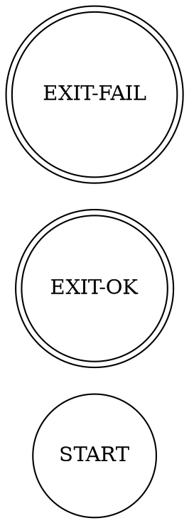

# Gherkin-to-DOT Bridge

This document describes how Gherkin acceptance scenarios map to DOT graph elements, enabling automated conversion between human-readable acceptance criteria and machine-executable pipeline graphs.

## Mapping Overview

| Gherkin Element | DOT Element | Notes |
|----------------|-------------|-------|
| `Feature:` | `digraph` name + `prd_ref` attribute | One feature = one graph |
| `Background:` | Shared predecessor edges from `START` | Setup steps become initial nodes |
| `Scenario:` | Linear chain of `box` nodes | One scenario = one path through the graph |
| `Scenario Outline:` | Parameterised node with `template=true` | Expanded at generation time |
| `Given` | Node with `phase=setup` | Precondition / environment prep |
| `When` | Node with `phase=action` | The operation under test |
| `Then` | Node with `phase=assertion` | Validation / acceptance check |
| `And` / `But` | Additional node inheriting parent phase | Continues previous step's phase |
| `@tag` | Node attribute or graph label | Used for filtering and grouping |

## Conversion Rules

### Rule 1: Feature → Graph

```gherkin
@PRD-INGEST-001
Feature: PDF Ingestion Pipeline
```

Becomes:



### Rule 2: Given/When/Then → Typed Nodes

```gherkin
Scenario: Successful PDF parsing
  Given a valid PDF file is uploaded
  When the parser extracts text content
  Then the extracted text is stored in the database
```

Becomes:

```dot
// Nodes
given_pdf_uploaded  [shape=box; handler=toolcall; label="Valid PDF uploaded";
                     phase=setup;     status=pending];
when_parse_text     [shape=box; handler=codergen; label="Parser extracts text";
                     phase=action;    status=pending];
then_text_stored    [shape=box; handler=toolcall; label="Text stored in DB";
                     phase=assertion; status=pending];

// Edges (linear happy path)
start              -> given_pdf_uploaded [label="begin"];
given_pdf_uploaded -> when_parse_text    [label="pass"];
when_parse_text    -> then_text_stored   [label="pass"];
then_text_stored   -> exit_ok            [label="pass"];

// Implicit failure edges for assertion nodes
then_text_stored   -> exit_fail          [label="fail"; condition=fail];
```

### Rule 3: And/But → Phase Continuation

```gherkin
Given a valid PDF file is uploaded
  And the file is under 10MB
When the parser extracts text content
Then the extracted text is stored in the database
  But duplicate entries are rejected
```

The `And` inherits `phase=setup`; the `But` inherits `phase=assertion`:

```dot
given_pdf_uploaded  [shape=box; phase=setup;     label="Valid PDF uploaded"];
given_under_10mb    [shape=box; phase=setup;     label="File under 10MB"];
when_parse_text     [shape=box; phase=action;    label="Parser extracts text"];
then_text_stored    [shape=box; phase=assertion; label="Text stored in DB"];
then_no_duplicates  [shape=box; phase=assertion; label="Duplicates rejected"];

start              -> given_pdf_uploaded [label="begin"];
given_pdf_uploaded -> given_under_10mb   [label="pass"];
given_under_10mb   -> when_parse_text    [label="pass"];
when_parse_text    -> then_text_stored   [label="pass"];
then_text_stored   -> then_no_duplicates [label="pass"];
then_no_duplicates -> exit_ok            [label="pass"];
```

### Rule 4: Scenario Outline → Template Nodes

```gherkin
Scenario Outline: Parse various file types
  Given a <filetype> file is uploaded
  When the parser runs
  Then extraction succeeds with <expected_count> entities

  Examples:
    | filetype | expected_count |
    | PDF      | 42             |
    | DOCX     | 38             |
```

Becomes a template node that expands at generation time:

```dot
// Template (unexpanded)
parse_filetype [shape=box; handler=codergen; label="Parse <filetype>";
                template=true; variants="PDF,DOCX"];

// Expanded (2 parallel paths from shared predecessor)
parse_pdf  [shape=box; handler=codergen; label="Parse PDF";  variant_of=parse_filetype];
parse_docx [shape=box; handler=codergen; label="Parse DOCX"; variant_of=parse_filetype];
```

### Rule 5: Background → Shared Setup Chain

```gherkin
Background:
  Given the system is authenticated
  And the database is seeded
```

These nodes become shared predecessors for **all** scenario paths:

```dot
bg_authenticated [shape=box; phase=setup; label="System authenticated"; shared=true];
bg_db_seeded     [shape=box; phase=setup; label="Database seeded";      shared=true];

start            -> bg_authenticated [label="begin"];
bg_authenticated -> bg_db_seeded     [label="pass"];

// Every scenario's first Given connects from bg_db_seeded
bg_db_seeded -> scenario_1_given [label="pass"];
bg_db_seeded -> scenario_2_given [label="pass"];
```

### Rule 6: Tags → Attributes

```gherkin
@smoke @priority-high
Scenario: Quick validation
```

Becomes node attributes:

```dot
quick_validation [shape=box; label="Quick validation";
                  tags="smoke,priority-high"; priority=1];
```

Tag-to-attribute mappings:

| Tag Pattern | DOT Attribute |
|------------|---------------|
| `@priority-high` | `priority=1` |
| `@priority-low` | `priority=3` |
| `@PRD-XXX-NNN` | `prd_ref="PRD-XXX-NNN"` (on graph) |
| `@smoke` / `@regression` | `tags="..."` |
| `@handler-codergen` | `handler=codergen` |

## Conversion Pseudo-Code

```python
def gherkin_to_dot(feature_file: str) -> str:
    """Convert a .feature file to a DOT pipeline graph."""
    feature = parse_gherkin(feature_file)

    graph_name = slugify(feature.name)
    prd_ref = extract_tag(feature.tags, pattern=r"PRD-\w+-\d+")

    lines = [
        f'digraph {graph_name} {{',
        f'    graph [rankdir=LR; prd_ref="{prd_ref}"];',
        f'    start   [shape=circle;       label="START"];',
        f'    exit_ok [shape=doublecircle; label="EXIT-OK"];',
        f'    exit_fail [shape=doublecircle; label="EXIT-FAIL"];',
        '',
    ]

    edges = []
    prev_node = 'start'

    # Background steps become shared setup
    if feature.background:
        for step in feature.background.steps:
            node_id = slugify(step.text)
            handler = infer_handler(step)
            lines.append(
                f'    {node_id} [shape=box; handler={handler}; '
                f'label="{step.text}"; phase=setup; shared=true; status=pending];'
            )
            edges.append(f'    {prev_node} -> {node_id} [label="pass"];')
            prev_node = node_id

    background_tail = prev_node  # fork point for scenarios

    # Each scenario becomes a path
    for scenario in feature.scenarios:
        prev_node = background_tail
        phase = None

        for step in scenario.steps:
            # Determine phase
            if step.keyword in ('Given', 'When', 'Then'):
                phase = {
                    'Given': 'setup',
                    'When':  'action',
                    'Then':  'assertion',
                }[step.keyword]
            # And/But inherits previous phase

            node_id = slugify(f"{scenario.name}_{step.text}")
            handler = infer_handler(step)
            priority = extract_priority(scenario.tags)

            lines.append(
                f'    {node_id} [shape=box; handler={handler}; '
                f'label="{step.text}"; phase={phase}; '
                f'priority={priority}; status=pending];'
            )
            edges.append(f'    {prev_node} -> {node_id} [label="pass"];')

            # Assertion nodes get implicit fail edges
            if phase == 'assertion':
                edges.append(
                    f'    {node_id} -> exit_fail '
                    f'[label="fail"; condition=fail];'
                )

            prev_node = node_id

        # Final node connects to exit_ok
        edges.append(f'    {prev_node} -> exit_ok [label="pass"];')

    lines.append('')
    lines.extend(edges)
    lines.append('}')

    return '\n'.join(lines)


def infer_handler(step) -> str:
    """Map step keywords to handler types."""
    if 'LLM' in step.text or 'extract' in step.text.lower():
        return 'codergen'
    return 'toolcall'


def extract_priority(tags: list[str]) -> int:
    """Extract priority from tags, default 2."""
    for tag in tags:
        if tag.startswith('priority-'):
            return {'high': 1, 'critical': 0, 'low': 3}.get(
                tag.split('-', 1)[1], 2
            )
    return 2
```

## CLI Integration

After conversion, use the attractor CLI to manage the generated graph:

```bash
# 1. Generate DOT from Gherkin (hypothetical converter)
python3 .claude/scripts/attractor/gherkin2dot.py \
    acceptance-tests/PRD-INGEST-001/scenarios.feature \
    --output pipeline.dot

# 2. Validate the generated graph
python3 .claude/scripts/attractor/cli.py validate pipeline.dot

# 3. Add missing nodes or adjust handlers
python3 .claude/scripts/attractor/cli.py node pipeline.dot modify extract_ent \
    --set handler=codergen

# 4. Checkpoint the validated graph
python3 .claude/scripts/attractor/cli.py checkpoint save pipeline.dot
```

## Round-Trip Consistency

The bridge supports round-trip conversion:

```
Gherkin → DOT → (execute pipeline) → update node statuses → score graph
```

When nodes complete, their status updates flow back to test reporting:

| DOT Node Status | Test Report Mapping |
|----------------|---------------------|
| `done` / `pass` | Scenario step PASSED |
| `fail` | Scenario step FAILED |
| `partial` | Scenario step PENDING (partial) |
| `blocked` | Scenario step SKIPPED |
| `pending` | Scenario step NOT RUN |

This enables a unified view where Gherkin acceptance tests and DOT pipeline progress share the same underlying state.

## Summary

- One `Feature` = one `digraph` with `prd_ref`
- `Given`/`When`/`Then` map to nodes with `phase` attributes
- `Background` steps become shared predecessors for all scenarios
- `Scenario Outline` produces template nodes expanded at generation
- Tags map to node attributes (`priority`, `handler`, `tags`)
- Assertion nodes (`Then`) automatically get `fail` edges to `EXIT-FAIL`
- The pseudo-code converter produces CLI-compatible DOT output
