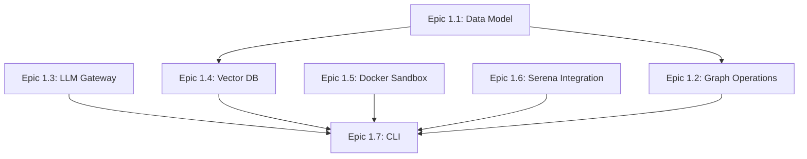

# PRD-RPG-P1-001: ZeroRepo Phase 1 - Foundation Infrastructure

**Version:** 1.0
**Status:** Draft
**Created:** 2026-02-07
**Phase:** 1 - Foundation (Data Model, Graph Primitives, Infrastructure)

---

## Problem Statement

ZeroRepo implements the Repository Planning Graph (RPG) approach for generating complete software repositories from natural language specifications. Before any planning, code generation, or validation can occur, we need robust foundational infrastructure:

1. **Data Model**: Pydantic schemas representing the RPG node/edge structure
2. **Graph Operations**: Core algorithms for graph manipulation, traversal, and analysis
3. **LLM Gateway**: Unified interface for multi-model LLM orchestration with cost tracking
4. **Vector Database**: Embedding-based feature storage for grounding and retrieval
5. **Execution Sandbox**: Isolated Docker environment for safe code execution and testing
6. **Serena Integration**: MCP-based incremental workspace validation
7. **CLI Scaffold**: User-facing command-line interface with structured logging

This phase delivers the primitives that all subsequent phases (planning, generation, validation) depend on.

---

## Epic 1.1: RPG Data Model (Pydantic Models)

### Description
Define the complete Pydantic schema for the Repository Planning Graph, including nodes, edges, and the graph container. These models serve as the single source of truth for all RPG operations.

### Tasks

#### Task 1.1.1: RPGNode Schema
**Acceptance Criteria:**
- Pydantic model `RPGNode` with field validation
- Fields:
  - `id`: UUID (auto-generated, immutable)
  - `name`: str (non-empty, max 200 chars)
  - `level`: Enum[MODULE, COMPONENT, FEATURE] (required)
  - `node_type`: Enum[FUNCTIONALITY, FOLDER_AUGMENTED, FILE_AUGMENTED, FUNCTION_AUGMENTED] (required)
  - `parent_id`: Optional[UUID] (foreign key to another node)
  - `folder_path`: Optional[str] (valid relative path)
  - `file_path`: Optional[str] (valid relative path, must start with folder_path if both present)
  - `interface_type`: Optional[Enum[FUNCTION, CLASS, METHOD]] (required if node_type is FUNCTION_AUGMENTED)
  - `signature`: Optional[str] (Python function/method signature)
  - `docstring`: Optional[str] (documentation)
  - `implementation`: Optional[str] (Python code)
  - `test_code`: Optional[str] (pytest test code)
  - `test_status`: Enum[PENDING, PASSED, FAILED, SKIPPED] (default: PENDING)
  - `serena_validated`: bool (default: False)
  - `actual_dependencies`: List[UUID] (default: [])
  - `metadata`: Dict[str, Any] (default: {})
- Validators:
  - `file_path` must be child of `folder_path` when both present
  - `signature` required when `interface_type` is set
  - `implementation` cannot be set without `file_path`
- JSON serialization round-trip without loss

**Unit Tests:**
- Valid node creation for each level/type combination
- Validation errors for invalid field combinations
- UUID uniqueness
- Path validation (folder_path contains file_path)
- JSON serialize → deserialize → equality check

**Functional Tests:**
- Create MODULE node → assert level, no parent
- Create FEATURE node with parent → assert parent_id set
- Create FUNCTION_AUGMENTED node → require interface_type, signature
- Attempt invalid file_path (not under folder_path) → ValidationError

#### Task 1.1.2: RPGEdge Schema
**Acceptance Criteria:**
- Pydantic model `RPGEdge` with field validation
- Fields:
  - `id`: UUID (auto-generated, immutable)
  - `source_id`: UUID (required, references RPGNode)
  - `target_id`: UUID (required, references RPGNode, must differ from source_id)
  - `edge_type`: Enum[HIERARCHY, DATA_FLOW, ORDERING, INHERITANCE, INVOCATION] (required)
  - `data_id`: Optional[str] (identifier for data flowing on edge)
  - `data_type`: Optional[str] (type annotation for data)
  - `transformation`: Optional[str] (description of data transformation)
  - `validated`: bool (default: False)
- Validators:
  - `source_id != target_id`
  - `data_id`, `data_type`, `transformation` only valid when `edge_type == DATA_FLOW`
- JSON serialization round-trip

**Unit Tests:**
- Valid edge creation for each edge_type
- Self-loop prevention (source_id == target_id → ValidationError)
- DATA_FLOW edge with data_id, data_type, transformation
- Non-DATA_FLOW edge with data_id → ValidationError
- JSON serialize → deserialize → equality

**Functional Tests:**
- Create HIERARCHY edge between MODULE and COMPONENT → assert edge_type
- Create DATA_FLOW edge with transformation → assert all data fields set
- Attempt self-loop edge → ValidationError
- Create INVOCATION edge → assert no data fields

#### Task 1.1.3: RPGGraph Container
**Acceptance Criteria:**
- Pydantic model `RPGGraph` managing nodes and edges
- Fields:
  - `nodes`: Dict[UUID, RPGNode] (indexed by node ID)
  - `edges`: Dict[UUID, RPGEdge] (indexed by edge ID)
  - `metadata`: Dict[str, Any] (graph-level metadata: project name, version, timestamp)
- Methods:
  - `add_node(node: RPGNode) -> UUID`: Add node, return ID
  - `add_edge(edge: RPGEdge) -> UUID`: Add edge (validate source/target exist)
  - `get_node(node_id: UUID) -> Optional[RPGNode]`
  - `get_edge(edge_id: UUID) -> Optional[RPGEdge]`
  - `remove_node(node_id: UUID) -> bool`: Remove node and all connected edges
  - `remove_edge(edge_id: UUID) -> bool`
  - `to_json() -> str`: Serialize to JSON string
  - `from_json(json_str: str) -> RPGGraph`: Deserialize from JSON
- Validators:
  - `add_edge()` raises ValueError if source_id or target_id not in nodes

**Unit Tests:**
- Add node → assert in nodes dict
- Add edge with valid nodes → success
- Add edge with missing source → ValueError
- Remove node → assert all connected edges removed
- JSON round-trip with 10 nodes, 15 edges → equality
- Empty graph → JSON → empty graph

**Functional Tests:**
- Build graph: 3 MODULE nodes, 5 COMPONENT children, 10 HIERARCHY edges
- Serialize → deserialize → assert node/edge counts match
- Remove MODULE node → assert all child COMPONENT nodes remain but parent edges removed

---

## Epic 1.2: Graph Operations

### Description
Implement core graph algorithms for traversal, analysis, filtering, and dependency management. These operations power the planning and validation workflows.

### Tasks

#### Task 1.2.1: Topological Sort with Cycle Detection
**Acceptance Criteria:**
- Function `topological_sort(graph: RPGGraph) -> List[UUID]`
  - Returns nodes in topological order (dependencies before dependents)
  - Considers HIERARCHY and DATA_FLOW edges as ordering constraints
  - Raises `CycleDetectedError` if cycles exist
- Function `detect_cycles(graph: RPGGraph) -> List[List[UUID]]`
  - Returns all cycles as lists of node IDs
  - Empty list if acyclic

**Unit Tests:**
- Acyclic graph (5 nodes, linear chain) → topological order
- Acyclic graph (10 nodes, diamond DAG) → valid topological order
- Graph with single cycle (A→B→C→A) → CycleDetectedError
- Graph with multiple cycles → detect all cycles
- Empty graph → empty list

**Functional Tests:**
- Build MODULE → COMPONENT → FEATURE hierarchy (20 nodes)
- Add DATA_FLOW edges → topological sort → assert features after components
- Introduce cycle (FEATURE depends on ancestor MODULE) → CycleDetectedError
- Call detect_cycles() → assert cycle path returned

#### Task 1.2.2: Subgraph Extraction
**Acceptance Criteria:**
- Function `extract_subgraph_by_module(graph: RPGGraph, module_id: UUID) -> RPGGraph`
  - Returns new graph with module node + all descendants (HIERARCHY edges)
- Function `extract_subgraph_by_level(graph: RPGGraph, level: NodeLevel) -> RPGGraph`
  - Returns new graph with all nodes of specified level
- Function `extract_subgraph_by_type(graph: RPGGraph, node_type: NodeType) -> RPGGraph`
  - Returns new graph with all nodes of specified type
- All functions preserve edges between extracted nodes

**Unit Tests:**
- Extract module with 3 component children → assert 4 nodes, 3 HIERARCHY edges
- Extract FEATURE level from graph with 5 FEATUREs, 3 COMPONENTs → assert 5 nodes
- Extract FUNCTION_AUGMENTED type → assert all returned nodes have node_type == FUNCTION_AUGMENTED
- Extract from empty graph → empty graph

**Functional Tests:**
- Build full RPG (3 modules, 10 components, 30 features)
- Extract module 1 → assert only module 1's descendants included
- Extract COMPONENT level → assert no MODULE or FEATURE nodes
- Extract subgraph → topological sort → assert still valid DAG

#### Task 1.2.3: Dependency Traversal
**Acceptance Criteria:**
- Function `get_ancestors(graph: RPGGraph, node_id: UUID, edge_types: List[EdgeType]) -> Set[UUID]`
  - Returns all ancestors reachable via specified edge types (transitive closure)
- Function `get_descendants(graph: RPGGraph, node_id: UUID, edge_types: List[EdgeType]) -> Set[UUID]`
  - Returns all descendants reachable via specified edge types
- Function `get_direct_dependencies(graph: RPGGraph, node_id: UUID) -> List[UUID]`
  - Returns immediate dependencies (outgoing DATA_FLOW or INVOCATION edges)

**Unit Tests:**
- Linear chain (A→B→C→D) → get_ancestors(D) == {A, B, C}
- Linear chain → get_descendants(A) == {B, C, D}
- DAG with diamond (A→B, A→C, B→D, C→D) → get_ancestors(D) == {A, B, C}
- Node with no dependencies → get_direct_dependencies() == []
- Filter by edge_type (only HIERARCHY) → assert DATA_FLOW edges ignored

**Functional Tests:**
- Build RPG with mixed edge types (HIERARCHY, DATA_FLOW, INVOCATION)
- Feature node with 3 INVOCATION dependencies → get_direct_dependencies() == 3 nodes
- Get ancestors with edge_types=[HIERARCHY] → assert only parent chain
- Get ancestors with edge_types=[DATA_FLOW, INVOCATION] → assert functional deps

#### Task 1.2.4: Node Filtering
**Acceptance Criteria:**
- Function `filter_nodes(graph: RPGGraph, predicate: Callable[[RPGNode], bool]) -> List[RPGNode]`
  - Returns nodes matching predicate
- Convenience functions:
  - `filter_by_status(graph: RPGGraph, status: TestStatus) -> List[RPGNode]`
  - `filter_by_validation(graph: RPGGraph, validated: bool) -> List[RPGNode]`
  - `filter_by_level(graph: RPGGraph, level: NodeLevel) -> List[RPGNode]`

**Unit Tests:**
- Filter by test_status=PASSED → assert all returned nodes have status PASSED
- Filter by serena_validated=True → assert all validated
- Filter by level=FEATURE → assert all level == FEATURE
- Custom predicate (node.name.startswith("auth_")) → assert name matching

**Functional Tests:**
- Graph with 100 nodes, 30 PASSED, 50 PENDING, 20 FAILED
- filter_by_status(PASSED) → assert 30 nodes
- filter_by_status(FAILED) → assert 20 nodes
- Filter validated features → assert subset of all features

#### Task 1.2.5: Dependency Diff
**Acceptance Criteria:**
- Function `diff_dependencies(node: RPGNode, graph: RPGGraph) -> Dict[str, List[UUID]]`
  - Returns: `{"planned": [...], "actual": [...], "missing": [...], "extra": [...]}`
  - `planned`: Dependencies from DATA_FLOW/INVOCATION edges
  - `actual`: Dependencies from `node.actual_dependencies` field
  - `missing`: In planned but not actual (planned - actual)
  - `extra`: In actual but not planned (actual - planned)

**Unit Tests:**
- Node with planned=[A,B,C], actual=[A,B,C] → missing=[], extra=[]
- Node with planned=[A,B], actual=[A,B,C] → missing=[], extra=[C]
- Node with planned=[A,B,C], actual=[A,B] → missing=[C], extra=[]
- Node with no edges → planned=[], actual from field

**Functional Tests:**
- Feature node with 5 planned INVOCATION edges
- Serena extracts actual_dependencies=[3 of the 5]
- diff_dependencies() → missing=[2 missing], extra=[]
- Add unplanned dependency to actual_dependencies → extra=[1]

#### Task 1.2.6: JSON Serialization
**Acceptance Criteria:**
- Function `serialize_graph(graph: RPGGraph, filepath: Path) -> None`
  - Write graph to JSON file with pretty formatting
- Function `deserialize_graph(filepath: Path) -> RPGGraph`
  - Load graph from JSON file
- Round-trip equality: `deserialize(serialize(G)) == G`
- Handle large graphs (1000+ nodes) efficiently (<1s for serialize + deserialize)

**Unit Tests:**
- Serialize empty graph → valid JSON
- Serialize graph with 10 nodes → deserialize → equality
- Serialize graph with all edge types → deserialize → all edges preserved
- Serialize graph with metadata → deserialize → metadata intact

**Functional Tests:**
- Build complex RPG (500 nodes, 1000 edges, nested metadata)
- Serialize to file → file size reasonable (<10MB)
- Deserialize → assert node count, edge count, sample node integrity
- Modify deserialized graph → re-serialize → different file

---

## Epic 1.3: LLM Gateway

### Description
Unified interface for multi-provider LLM access via LiteLLM, with tiered model selection, cost tracking, retry logic, and prompt template management.

### Tasks

#### Task 1.3.1: LiteLLM Integration
**Acceptance Criteria:**
- Class `LLMGateway` wrapping LiteLLM's `completion()` API
- Support for providers: OpenAI (gpt-4o, gpt-4o-mini), Anthropic (claude-3.5-sonnet, claude-3-haiku), Ollama (llama3.2)
- Configuration from environment variables (`OPENAI_API_KEY`, `ANTHROPIC_API_KEY`) or config dict
- Method `complete(messages: List[Dict], model: str, **kwargs) -> str`
  - Returns assistant response text
  - Handles provider routing automatically
- Method `complete_json(messages: List[Dict], model: str, response_schema: Type[BaseModel]) -> BaseModel`
  - Returns structured Pydantic model
  - Uses JSON mode or function calling depending on provider

**Unit Tests:**
- Mock LiteLLM completion → call complete() → assert response text extracted
- Mock JSON mode completion → call complete_json() → assert Pydantic model returned
- Invalid model name → raise ValueError
- Missing API key → raise ConfigurationError

**Functional Tests:**
- Real OpenAI call (gpt-4o-mini) with simple prompt → assert response non-empty
- Real Anthropic call (claude-3-haiku) → assert response non-empty
- JSON completion with schema (FeatureExtraction model) → assert valid Pydantic object
- Ollama call (local model) → assert response or skip if unavailable

#### Task 1.3.2: Tiered Model Selection
**Acceptance Criteria:**
- Enum `ModelTier` with values: CHEAP, MEDIUM, STRONG
- Configuration mapping tiers to models:
  - CHEAP: gpt-4o-mini, claude-3-haiku
  - MEDIUM: gpt-4o, claude-3.5-sonnet
  - STRONG: gpt-4o (with reasoning), claude-opus (future)
- Method `select_model(tier: ModelTier, provider_preference: Optional[str]) -> str`
  - Returns model name based on tier + provider preference
  - Falls back to cheapest available if preference unavailable

**Unit Tests:**
- select_model(CHEAP, "openai") → "gpt-4o-mini"
- select_model(MEDIUM, "anthropic") → "claude-3.5-sonnet"
- select_model(STRONG, None) → default strong model
- select_model(CHEAP, "invalid_provider") → fallback to cheapest

**Functional Tests:**
- Configure gateway with tier mappings
- Call select_model(CHEAP) → use in completion → assert low-cost response
- Call select_model(STRONG) → use in complex reasoning task → assert high-quality response

#### Task 1.3.3: Request/Response Logging
**Acceptance Criteria:**
- All LLM requests logged to structured JSON logs
- Log schema:
  - `timestamp`: ISO 8601
  - `request_id`: UUID
  - `model`: str
  - `tier`: ModelTier
  - `messages`: List[Dict] (truncated if >1000 chars)
  - `response`: str (truncated if >1000 chars)
  - `tokens_prompt`: int
  - `tokens_completion`: int
  - `tokens_total`: int
  - `latency_ms`: float
  - `cost_usd`: float (estimated)
- Method `get_logs(start_time: datetime, end_time: datetime) -> List[Dict]`
  - Returns logs in time range

**Unit Tests:**
- Mock completion → assert log entry created
- Log entry contains all required fields
- Truncation of long messages (>1000 chars)
- get_logs() filters by time correctly

**Functional Tests:**
- Make 5 LLM calls → assert 5 log entries
- get_logs(last_hour) → assert correct count
- Parse logs → assert token counts sum correctly
- Export logs to JSON file → valid JSON

#### Task 1.3.4: Token Usage Tracking
**Acceptance Criteria:**
- Class `TokenTracker` accumulating usage across requests
- Methods:
  - `record(model: str, prompt_tokens: int, completion_tokens: int) -> None`
  - `get_total_tokens() -> int`
  - `get_total_cost() -> float` (using approximate pricing)
  - `get_breakdown_by_model() -> Dict[str, Dict[str, int]]`
- Integration with LLMGateway: auto-record after each completion
- Pricing table (approximate USD):
  - gpt-4o-mini: $0.15/1M input, $0.60/1M output
  - gpt-4o: $2.50/1M input, $10/1M output
  - claude-3-haiku: $0.25/1M input, $1.25/1M output
  - claude-3.5-sonnet: $3/1M input, $15/1M output

**Unit Tests:**
- Record usage → assert total_tokens increases
- Record multiple models → breakdown by model correct
- Cost calculation for known usage → assert within 1% of expected
- Reset tracker → assert totals zero

**Functional Tests:**
- Make 10 LLM calls (5 CHEAP, 5 MEDIUM)
- get_total_tokens() → assert reasonable total (e.g., 5k-50k)
- get_total_cost() → assert MEDIUM tier costs more
- get_breakdown_by_model() → assert both models present

#### Task 1.3.5: Retry Logic
**Acceptance Criteria:**
- Automatic retry on transient failures (rate limits, timeouts)
- Exponential backoff: 1s, 2s, 4s, 8s (max 4 retries)
- Retry on errors: `RateLimitError`, `Timeout`, `APIConnectionError`
- No retry on: `AuthenticationError`, `InvalidRequestError`
- Method `complete()` transparently retries
- Logging of retry attempts

**Unit Tests:**
- Mock RateLimitError → assert 4 retry attempts → final failure
- Mock transient error then success → assert success on retry 2
- Mock AuthenticationError → assert immediate failure (no retry)
- Assert exponential backoff delays (1, 2, 4, 8 seconds)

**Functional Tests:**
- Simulate rate limit (mock API) → assert retries logged
- Real API call with aggressive rate (trigger rate limit) → assert retry + eventual success
- Invalid API key → assert immediate failure

#### Task 1.3.6: Prompt Template Management
**Acceptance Criteria:**
- Class `PromptTemplate` with Jinja2 rendering
- Method `render(template_name: str, variables: Dict[str, Any]) -> str`
  - Loads template from `templates/{template_name}.jinja2`
  - Renders with variables
- Built-in templates (minimal set for Phase 1):
  - `feature_extraction.jinja2`: Extract features from spec
  - `module_planning.jinja2`: Plan module decomposition
  - `function_generation.jinja2`: Generate function implementation
- Template variables validated against schema

**Unit Tests:**
- Render simple template with variables → assert correct output
- Missing variable → raise TemplateError
- Invalid template name → raise FileNotFoundError
- Test each built-in template with sample data

**Functional Tests:**
- Render feature_extraction template with spec text → assert valid prompt
- Use rendered prompt in LLM call → assert response parsable
- Create custom template → render → use in completion

---

## Epic 1.4: Vector Database Integration

### Description
ChromaDB-based embedding storage for feature trees, enabling similarity search for grounding and retrieval during planning.

### Tasks

#### Task 1.4.1: ChromaDB Setup
**Acceptance Criteria:**
- Class `VectorStore` wrapping ChromaDB client
- Persistent storage in `{project_dir}/.zerorepo/chroma/`
- Collection: `feature_trees` with metadata schema:
  - `node_id`: UUID
  - `level`: NodeLevel
  - `node_type`: NodeType
  - `path`: str (hierarchical path, e.g., "auth/user_management/login")
- Embedding function: `text-embedding-3-small` (OpenAI) or `all-MiniLM-L6-v2` (local)
- Method `initialize(project_dir: Path, embedding_model: str) -> None`
  - Creates/opens collection

**Unit Tests:**
- Initialize store → assert collection exists
- Initialize twice → assert idempotent (no error)
- Invalid project_dir → raise ValueError
- Collection metadata schema → assert fields present

**Functional Tests:**
- Initialize with OpenAI embeddings → assert API key required
- Initialize with local embeddings → assert no API key needed
- Check ChromaDB storage directory → assert files created

#### Task 1.4.2: Embedding Generation
**Acceptance Criteria:**
- Method `embed(text: str) -> List[float]`
  - Returns embedding vector (384 or 1536 dimensions depending on model)
- Method `embed_batch(texts: List[str]) -> List[List[float]]`
  - Batches up to 100 texts per request (for OpenAI)
  - Returns embeddings in same order as inputs
- Caching of embeddings by text hash (optional optimization)

**Unit Tests:**
- embed("hello world") → assert vector length correct
- embed_batch([...10 texts...]) → assert 10 vectors returned
- embed same text twice → assert same vector (deterministic)
- Empty text → raise ValueError

**Functional Tests:**
- Embed 100 feature descriptions → assert all vectors generated
- Embed batch with OpenAI model → assert API call count reasonable (<10)
- Embed batch with local model → assert no API calls

#### Task 1.4.3: Feature Tree Storage
**Acceptance Criteria:**
- Method `add_node(node: RPGNode) -> None`
  - Embeds `node.name + node.docstring`
  - Stores with metadata: node_id, level, node_type, path
- Method `add_nodes_batch(nodes: List[RPGNode]) -> None`
  - Batch operation for efficiency
- Hierarchical path construction: `parent.path + "/" + node.name`

**Unit Tests:**
- Add single node → assert stored in collection
- Add batch of 50 nodes → assert all stored
- Add node with parent → assert path includes parent path
- Add node without docstring → assert name-only embedding

**Functional Tests:**
- Build RPG with 100 nodes
- add_nodes_batch(all nodes) → assert collection size == 100
- Query collection → assert metadata fields populated

#### Task 1.4.4: Similarity Search
**Acceptance Criteria:**
- Method `search(query: str, top_k: int = 10, filters: Optional[Dict] = None) -> List[Tuple[RPGNode, float]]`
  - Returns (node, similarity_score) tuples
  - Supports metadata filters: level, node_type, path prefix
- Method `search_by_node(node: RPGNode, top_k: int = 10) -> List[Tuple[RPGNode, float]]`
  - Find similar nodes to given node

**Unit Tests:**
- Search for "authentication" → assert auth-related nodes ranked high
- Search with filter (level=FEATURE) → assert only FEATUREs returned
- Search with top_k=5 → assert exactly 5 results
- Empty collection → search → empty results

**Functional Tests:**
- Add 50 feature nodes (10 auth, 10 payment, 10 analytics, 20 misc)
- Search "user login" → assert auth nodes in top 5
- Search "payment processing" with filter(level=FEATURE) → assert payment FEATUREs
- search_by_node(auth_node) → assert other auth nodes similar

#### Task 1.4.5: Collection Management
**Acceptance Criteria:**
- Method `clear() -> None`: Delete all documents from collection
- Method `delete_node(node_id: UUID) -> None`: Remove specific node
- Method `get_stats() -> Dict[str, int]`: Return collection stats (count, by level, by type)

**Unit Tests:**
- Add 10 nodes → clear() → assert count == 0
- Add 10 nodes → delete_node(one) → assert count == 9
- get_stats() → assert correct breakdown

**Functional Tests:**
- Add 100 nodes → get_stats() → assert counts by level
- Clear collection → search → assert empty results
- Delete node → search for it → assert not found

---

## Epic 1.5: Docker Sandbox

### Description
Isolated Docker container environment for executing generated code and running tests safely with resource limits.

### Tasks

#### Task 1.5.1: Docker Container Lifecycle
**Acceptance Criteria:**
- Class `DockerSandbox` managing container lifecycle
- Base image: `python:3.11-slim` with pytest pre-installed
- Method `start(workspace_dir: Path, timeout: int = 300) -> str`
  - Creates container with workspace mounted at `/workspace`
  - Returns container ID
- Method `stop(container_id: str) -> None`
  - Stops and removes container
- Resource limits:
  - Memory: 512MB
  - CPU: 1 core
  - Timeout: configurable (default 5 minutes)

**Unit Tests:**
- start() → assert container ID returned
- start() → stop() → assert container removed
- start() with invalid workspace_dir → raise ValueError
- start() without Docker daemon → raise DockerError

**Functional Tests:**
- start() → docker ps → assert container running
- stop() → docker ps → assert container gone
- start() → wait → assert timeout kills container after limit

#### Task 1.5.2: Dependency Installation
**Acceptance Criteria:**
- Method `install_dependencies(container_id: str, requirements: List[str]) -> bool`
  - Writes requirements to `/workspace/requirements.txt`
  - Runs `pip install -r requirements.txt` in container
  - Returns True on success, False on failure
- Method `install_dependencies_from_file(container_id: str, requirements_file: Path) -> bool`
  - Copies file to container, installs
- Captures pip output for debugging

**Unit Tests:**
- Mock container exec → install_dependencies(["requests"]) → assert success
- Mock pip failure → assert False returned
- Empty requirements list → assert success (no-op)

**Functional Tests:**
- start() → install_dependencies(["pytest", "requests"]) → assert installed
- Verify with exec: `pip list` → assert packages present
- Install invalid package → assert failure + error logged

#### Task 1.5.3: Code Execution
**Acceptance Criteria:**
- Method `run_code(container_id: str, code: str, entrypoint: str = "main.py") -> ExecutionResult`
  - Writes code to `/workspace/{entrypoint}`
  - Executes with `python /workspace/{entrypoint}`
  - Returns ExecutionResult(stdout, stderr, exit_code, duration_ms)
- Method `run_script(container_id: str, script_path: Path) -> ExecutionResult`
  - Copies script to container, executes
- Timeout enforcement (kill process after limit)

**Unit Tests:**
- Mock exec → run_code("print('hello')") → assert stdout == "hello\n"
- Mock exec → run_code with syntax error → assert exit_code != 0
- Mock timeout → assert ExecutionResult.exit_code == -1

**Functional Tests:**
- start() → run_code("import sys; print(sys.version)") → assert Python 3.11
- run_code with infinite loop → assert timeout kills it
- run_code with import error → assert stderr contains traceback

#### Task 1.5.4: Pytest Execution
**Acceptance Criteria:**
- Method `run_tests(container_id: str, test_dir: str = "/workspace") -> TestResult`
  - Runs `pytest {test_dir} --json-report --json-report-file=/workspace/report.json`
  - Parses JSON report into TestResult:
    - `total`: int
    - `passed`: int
    - `failed`: int
    - `skipped`: int
    - `errors`: int
    - `duration`: float
    - `failures`: List[TestFailure] (name, traceback)
- Handles pytest not finding tests (returns total=0)

**Unit Tests:**
- Mock pytest JSON report → run_tests() → assert TestResult parsed
- Mock pytest with failures → assert failures list populated
- Mock pytest with no tests → assert total=0

**Functional Tests:**
- Write test_sample.py with 3 passing tests → run_tests() → assert passed=3
- Write test with 2 failures → run_tests() → assert failed=2, failures list length=2
- Empty test directory → run_tests() → assert total=0

#### Task 1.5.5: File System Operations
**Acceptance Criteria:**
- Method `write_file(container_id: str, path: str, content: str) -> None`
  - Writes content to path inside container
- Method `read_file(container_id: str, path: str) -> str`
  - Reads file from container
- Method `list_files(container_id: str, path: str = "/workspace") -> List[str]`
  - Returns list of files in directory

**Unit Tests:**
- Mock write_file → read_file → assert content matches
- Mock list_files → assert file list returned
- write_file to invalid path → raise IOError

**Functional Tests:**
- start() → write_file("/workspace/test.txt", "hello") → read_file → assert "hello"
- write_file → list_files("/workspace") → assert "test.txt" in list
- Write Python file → run_code on it → assert executes

#### Task 1.5.6: Cleanup and Error Handling
**Acceptance Criteria:**
- Context manager support: `with DockerSandbox() as sandbox:`
  - Auto-start on enter, auto-stop on exit
- Method `cleanup(force: bool = False) -> None`
  - Removes all ZeroRepo containers (filter by label)
- Graceful handling of Docker errors (daemon down, permission issues)

**Unit Tests:**
- with DockerSandbox() → assert start/stop called
- cleanup() → assert all containers removed
- Docker daemon down → assert DockerError with clear message

**Functional Tests:**
- Create 3 sandboxes → cleanup() → docker ps -a → assert none remain
- with DockerSandbox() → raise exception inside → assert container still stopped
- Permission error (non-Docker user) → assert graceful error message

---

## Epic 1.6: Serena Integration Bootstrap

### Description
Integrate Serena MCP server for incremental workspace validation, symbol lookup, and Pyright language server configuration.

### Tasks

#### Task 1.6.1: Serena MCP Server Lifecycle
**Acceptance Criteria:**
- Class `SerenaMCPServer` managing Serena server process
- Method `start(workspace_dir: Path, pyright_config: Optional[Path] = None) -> None`
  - Launches Serena MCP server via `npx @ai16z/serena`
  - Configures workspace directory
  - Optionally uses custom `pyrightconfig.json`
- Method `stop() -> None`
  - Gracefully shuts down server
- Method `is_running() -> bool`
  - Checks if server process alive

**Unit Tests:**
- Mock process launch → start() → assert is_running() == True
- start() → stop() → assert is_running() == False
- start() without npx available → raise EnvironmentError
- start() with invalid workspace_dir → raise ValueError

**Functional Tests:**
- start() with valid workspace → ps aux → assert Serena process
- stop() → ps aux → assert process terminated
- start() → stop() → start() → assert restarts successfully

#### Task 1.6.2: MCP Client for Tool Invocation
**Acceptance Criteria:**
- Class `MCPClient` for calling Serena tools
- Method `call_tool(tool_name: str, arguments: Dict[str, Any]) -> Dict[str, Any]`
  - Invokes MCP tool via stdio transport
  - Returns tool response as dict
- Supported tools (for Phase 1):
  - `activate_project`: Initialize workspace
  - `find_symbol`: Locate symbol by name
  - `get_symbols_overview`: Get all symbols in workspace
  - `list_dir`: List directory contents
- Error handling for tool not found, invalid arguments

**Unit Tests:**
- Mock MCP response → call_tool("find_symbol", {...}) → assert response parsed
- Mock error response → assert raises MCPError
- call_tool with invalid tool → raise ToolNotFoundError

**Functional Tests:**
- start() → call_tool("activate_project", {path: workspace}) → assert success
- call_tool("list_dir", {path: "/"}) → assert file list returned
- call_tool with invalid args → assert error response

#### Task 1.6.3: Incremental Workspace Initialization
**Acceptance Criteria:**
- Method `initialize_workspace(workspace_dir: Path, files: List[Path]) -> None`
  - Calls `activate_project` with workspace path
  - Incrementally adds files to workspace
  - Waits for Pyright analysis to complete
- Method `add_file(filepath: Path) -> None`
  - Adds single file to workspace
  - Triggers Pyright re-analysis

**Unit Tests:**
- Mock activate_project → initialize_workspace() → assert called
- Mock add_file → assert MCP call made

**Functional Tests:**
- Create workspace with 5 Python files
- initialize_workspace() → assert Pyright analyzes all files
- add_file(new_file.py) → get_symbols_overview() → assert new symbols appear

#### Task 1.6.4: Symbol Lookup
**Acceptance Criteria:**
- Method `find_symbol(name: str, workspace_dir: Path) -> Optional[SymbolInfo]`
  - Calls Serena's `find_symbol` tool
  - Returns SymbolInfo(name, kind, filepath, line, column, docstring)
- Method `get_symbols_overview(workspace_dir: Path) -> List[SymbolInfo]`
  - Calls Serena's `get_symbols_overview`
  - Returns all symbols in workspace

**Unit Tests:**
- Mock find_symbol → assert SymbolInfo returned
- Mock symbol not found → assert None
- Mock get_symbols_overview → assert list of symbols

**Functional Tests:**
- Write Python file with class, function, variable
- initialize_workspace()
- find_symbol("MyClass") → assert SymbolInfo with kind=class
- get_symbols_overview() → assert 3 symbols found

#### Task 1.6.5: Pyright Configuration
**Acceptance Criteria:**
- Method `configure_pyright(workspace_dir: Path, config: PyrightConfig) -> None`
  - Writes `pyrightconfig.json` to workspace
  - PyrightConfig model with fields: include, exclude, typeCheckingMode, reportMissingImports
- Default config for ZeroRepo:
  - `include: ["**/*.py"]`
  - `exclude: ["**/node_modules", "**/__pycache__"]`
  - `typeCheckingMode: "basic"`
  - `reportMissingImports: true`

**Unit Tests:**
- configure_pyright() → assert pyrightconfig.json written
- Assert JSON schema valid

**Functional Tests:**
- configure_pyright() → start() → assert Pyright uses config
- Set reportMissingImports=false → import nonexistent → assert no error

#### Task 1.6.6: Dependency Extraction
**Acceptance Criteria:**
- Method `extract_dependencies(symbol: str, workspace_dir: Path) -> List[str]`
  - Uses Serena's `find_referencing_symbols` to find what symbol depends on
  - Returns list of referencing symbol names
- Integration with RPGNode.actual_dependencies field

**Unit Tests:**
- Mock find_referencing_symbols → extract_dependencies() → assert list returned

**Functional Tests:**
- Write file1.py with function A
- Write file2.py importing and calling A
- initialize_workspace()
- extract_dependencies("A") → assert ["file2.function_calling_A"]

---

## Epic 1.7: CLI Scaffold

### Description
User-facing command-line interface built with Click/Typer, providing subcommands for all ZeroRepo operations with structured logging and progress reporting.

### Tasks

#### Task 1.7.1: CLI Framework Setup
**Acceptance Criteria:**
- CLI built with Typer
- Main command: `zerorepo`
- Subcommands (stubs for Phase 1):
  - `init`: Initialize project
  - `plan`: Generate planning graph
  - `build`: Execute build phases
  - `generate`: Generate code from plan
  - `validate`: Run validation
  - `export`: Export repository
- Global options:
  - `--config`: Path to config file (default: `zerorepo.yaml`)
  - `--verbose`: Enable debug logging
  - `--log-file`: Log output file

**Unit Tests:**
- CLI imports without error
- `zerorepo --help` → assert subcommands listed
- `zerorepo init --help` → assert options listed

**Functional Tests:**
- `zerorepo --version` → assert version string
- `zerorepo --help` → assert usage text
- `zerorepo invalid-command` → assert error message

#### Task 1.7.2: Configuration File Support
**Acceptance Criteria:**
- Configuration model: `ZeroRepoConfig` (Pydantic)
- Fields:
  - `project_name`: str
  - `output_dir`: Path
  - `llm_provider`: str (default: "openai")
  - `llm_model_tier`: ModelTier (default: MEDIUM)
  - `embedding_model`: str (default: "text-embedding-3-small")
  - `vector_db_path`: Path (default: "{output_dir}/.zerorepo/chroma")
  - `max_retries`: int (default: 3)
  - `timeout_seconds`: int (default: 300)
- Method `load_config(filepath: Path) -> ZeroRepoConfig`
  - Loads YAML config, validates with Pydantic
- Method `save_config(config: ZeroRepoConfig, filepath: Path) -> None`

**Unit Tests:**
- load_config with valid YAML → assert ZeroRepoConfig returned
- load_config with invalid YAML → raise ValidationError
- save_config → load_config → assert equality

**Functional Tests:**
- Create zerorepo.yaml with custom settings
- `zerorepo --config=zerorepo.yaml init` → assert config loaded
- Invalid config file → assert helpful error message

#### Task 1.7.3: Structured Logging
**Acceptance Criteria:**
- JSON structured logging using `structlog`
- Log levels: DEBUG, INFO, WARNING, ERROR
- Log fields:
  - `timestamp`: ISO 8601
  - `level`: str
  - `logger`: str (module name)
  - `event`: str (message)
  - `context`: Dict (extra fields)
- Console output: Human-readable with colors (via Rich)
- File output: JSON lines
- Method `setup_logging(verbose: bool, log_file: Optional[Path]) -> None`

**Unit Tests:**
- setup_logging() → assert logger configured
- Log INFO message → assert appears in console
- Log to file → assert JSON format

**Functional Tests:**
- `zerorepo --verbose init` → assert DEBUG messages appear
- `zerorepo --log-file=app.log init` → assert log file created
- Parse log file → assert valid JSON lines

#### Task 1.7.4: Progress Reporting
**Acceptance Criteria:**
- Class `ProgressReporter` wrapping Rich progress bars
- Method `start_task(name: str, total: int) -> int`
  - Returns task ID
- Method `update_task(task_id: int, completed: int) -> None`
- Method `finish_task(task_id: int) -> None`
- Integration with CLI commands
- Disable progress bars when `--log-file` used (avoid ANSI in logs)

**Unit Tests:**
- start_task() → assert task ID returned
- update_task() → assert progress updated (mock)
- finish_task() → assert task completed

**Functional Tests:**
- Simulate long operation (embed 100 items) → assert progress bar visible
- `zerorepo --log-file=app.log <long-op>` → assert no progress bar output

#### Task 1.7.5: Init Command Implementation
**Acceptance Criteria:**
- `zerorepo init [PROJECT_NAME]` command
- Creates project directory structure:
  ```
  {project_name}/
    zerorepo.yaml
    specs/
    .zerorepo/
      chroma/
      logs/
  ```
- Writes default config to `zerorepo.yaml`
- Initializes VectorStore (ChromaDB)
- Validates dependencies (Docker, npx, API keys)

**Unit Tests:**
- Mock file system → init command → assert directories created
- Mock config write → assert valid YAML

**Functional Tests:**
- `zerorepo init my-project` → assert directory structure created
- `zerorepo init my-project` (existing) → assert error
- `zerorepo init --force my-project` (existing) → assert overwrite

#### Task 1.7.6: Error Handling and User Feedback
**Acceptance Criteria:**
- All exceptions caught at CLI boundary
- User-friendly error messages (no tracebacks in default mode)
- Tracebacks in `--verbose` mode
- Exit codes:
  - 0: Success
  - 1: General error
  - 2: Invalid configuration
  - 3: Missing dependency
  - 4: API error

**Unit Tests:**
- Raise ConfigError in command → assert exit code 2
- Raise APIError → assert exit code 4

**Functional Tests:**
- `zerorepo init` without Docker → assert clear error message + exit code 3
- `zerorepo --config=invalid.yaml init` → assert exit code 2
- `zerorepo --verbose <error-command>` → assert traceback printed

---

## Cross-Epic Dependencies

### Dependency Graph



### Build Order

1. **Epic 1.1** (Data Model) - Foundation for all graph operations
2. **Epic 1.2** (Graph Operations) - Depends on 1.1
3. **Epic 1.3** (LLM Gateway) - Independent, can run parallel to 1.1/1.2
4. **Epic 1.4** (Vector DB) - Depends on 1.1 (RPGNode schema)
5. **Epic 1.5** (Docker Sandbox) - Independent, can run parallel
6. **Epic 1.6** (Serena Integration) - Independent, can run parallel
7. **Epic 1.7** (CLI Scaffold) - Depends on all others (integration point)

---

## Technology Decisions

### Core Stack
| Component | Technology | Rationale |
|-----------|------------|-----------|
| Data Model | Pydantic v2 | Type safety, validation, JSON serialization |
| Graph Storage | In-memory + JSON | Simplicity for Phase 1, migrate to DB in Phase 2 |
| LLM Interface | LiteLLM | Multi-provider support, unified API |
| Vector DB | ChromaDB | Local-first, easy setup, SQLite backend |
| Code Execution | Docker | Isolation, security, reproducibility |
| Validation | Serena MCP | Pyright integration, symbol extraction |
| CLI | Typer | Modern, type-safe, rich help text |
| Logging | Structlog + Rich | Structured JSON logs, beautiful console output |

### API Keys Required
- `OPENAI_API_KEY`: For gpt-4o, gpt-4o-mini, text-embedding-3-small
- `ANTHROPIC_API_KEY`: For claude-3.5-sonnet, claude-3-haiku
- Optional: Ollama (local, no key needed)

### Development Environment
- Python 3.11+
- Docker 20.10+
- Node.js 18+ (for Serena MCP server)
- Git

---

## Testing Strategy

### Unit Tests (70% Coverage Minimum)
- All Pydantic models: validation, serialization
- All graph operations: correctness, edge cases
- LLM Gateway: mocking LiteLLM responses
- Vector DB: mocking ChromaDB operations
- Docker Sandbox: mocking Docker SDK
- Serena: mocking MCP responses
- CLI: mocking file system, user input

**Framework:** pytest + pytest-mock + pytest-cov

### Functional Tests (End-to-End)
- Real LLM calls (small sample, conditional on API keys)
- Real Docker container lifecycle
- Real ChromaDB persistence
- Real Serena MCP server integration
- Real CLI commands (temp directories)

**Framework:** pytest with `@pytest.mark.functional` decorator

### Integration Tests (Phase 1 Complete)
- Build RPG (200 nodes) → Serialize → Deserialize → Validate
- Embed all nodes → Similarity search → Assert relevance
- Generate code → Docker execution → Pytest results
- Full CLI workflow: init → plan (stub) → validate (stub)

### Performance Benchmarks
- Graph operations: 1000 nodes in <100ms
- Serialization: 1000 nodes in <500ms
- Embedding: 100 texts in <5s (OpenAI) or <1s (local)
- Docker startup: <3s per container

---

## Acceptance Criteria (Phase 1 Complete)

### Functional Requirements
- ✅ RPGNode and RPGEdge models with full validation
- ✅ RPGGraph with add/remove/serialize operations
- ✅ Topological sort, cycle detection, subgraph extraction
- ✅ Dependency traversal and diff
- ✅ LLM Gateway supporting OpenAI, Anthropic, Ollama
- ✅ Token tracking and cost estimation
- ✅ Retry logic with exponential backoff
- ✅ ChromaDB collection with feature embeddings
- ✅ Similarity search with metadata filters
- ✅ Docker sandbox with code execution and pytest
- ✅ Serena MCP server lifecycle and tool invocation
- ✅ Symbol lookup and dependency extraction
- ✅ CLI with init command and structured logging

### Non-Functional Requirements
- ✅ Unit test coverage ≥70%
- ✅ All public APIs have docstrings
- ✅ Type hints for all function signatures
- ✅ Structured logging for all operations
- ✅ Configuration via YAML file
- ✅ Error messages user-friendly (no raw tracebacks)

### Documentation
- ✅ README with installation instructions
- ✅ API reference (auto-generated from docstrings)
- ✅ Configuration schema documentation
- ✅ Architecture diagram (data flow)

---

## Out of Scope (Phase 1)

### Deferred to Later Phases
- ❌ Actual planning logic (Phase 2: Graph Construction)
- ❌ Code generation from templates (Phase 3: Codegen)
- ❌ Multi-phase execution orchestration (Phase 4: Orchestration)
- ❌ Web UI for graph visualization (Phase 5: Visualization)
- ❌ Distributed execution (Phase 6: Scale)
- ❌ Advanced Serena operations (insert, rename, replace)
- ❌ Database backend for graph storage (use JSON for now)
- ❌ Real-time collaboration (Phase 7: Collaboration)

### Known Limitations
- Single-threaded execution (no async in Phase 1)
- In-memory graph (memory limits for huge repos)
- Basic error handling (improve in Phase 2)
- No incremental updates to vector DB (rebuild on change)

---

## Success Metrics

### Quantitative
- Unit test pass rate: 100%
- Functional test pass rate: ≥95% (allowing for external service flakiness)
- CLI help text completeness: All subcommands documented
- Serialization round-trip: 100% fidelity (no data loss)

### Qualitative
- Developer can install and run `zerorepo init` in <5 minutes
- Clear error messages guide users to fix configuration issues
- Logs provide actionable debugging information
- Code is readable and well-structured for future contributions

---

## Risks and Mitigations

| Risk | Impact | Mitigation |
|------|--------|-----------|
| LLM API rate limits | High | Retry logic, fallback to cheaper models, local caching |
| Docker not installed | High | Clear error message, installation guide in docs |
| ChromaDB persistence issues | Medium | Write tests for persistence, document known issues |
| Serena MCP server crashes | Medium | Process monitoring, auto-restart, fallback to basic validation |
| Large graphs exceed memory | Medium | Document limits, defer to DB backend in Phase 2 |
| API key costs | Low | Token tracking, budget alerts, local model fallback |

---

## Timeline Estimate (1 Engineer)

| Epic | Estimated Days | Cumulative |
|------|----------------|------------|
| 1.1: Data Model | 2 | 2 |
| 1.2: Graph Operations | 3 | 5 |
| 1.3: LLM Gateway | 4 | 9 |
| 1.4: Vector DB | 3 | 12 |
| 1.5: Docker Sandbox | 4 | 16 |
| 1.6: Serena Integration | 3 | 19 |
| 1.7: CLI Scaffold | 3 | 22 |
| Integration Testing | 2 | 24 |
| Documentation | 2 | 26 |

**Total:** ~5 weeks (1 engineer) or ~2 weeks (2 engineers in parallel)

---

## Appendix: Sample Configurations

### zerorepo.yaml (Default)
```yaml
project_name: "my-zerorepo-project"
output_dir: "./output"
llm_provider: "openai"
llm_model_tier: "MEDIUM"
embedding_model: "text-embedding-3-small"
vector_db_path: "./output/.zerorepo/chroma"
max_retries: 3
timeout_seconds: 300
docker:
  memory_limit: "512m"
  cpu_limit: 1
  base_image: "python:3.11-slim"
serena:
  pyright_mode: "basic"
  report_missing_imports: true
logging:
  level: "INFO"
  format: "json"
  file: "./output/.zerorepo/logs/zerorepo.log"
```

### pyrightconfig.json (Default)
```json
{
  "include": ["**/*.py"],
  "exclude": ["**/node_modules", "**/__pycache__", "**/.venv"],
  "typeCheckingMode": "basic",
  "reportMissingImports": true,
  "reportMissingTypeStubs": false,
  "pythonVersion": "3.11"
}
```

---

## Appendix: RPG Schema Examples

### Sample RPGNode (MODULE level)
```json
{
  "id": "550e8400-e29b-41d4-a716-446655440000",
  "name": "authentication",
  "level": "MODULE",
  "node_type": "FUNCTIONALITY",
  "parent_id": null,
  "folder_path": "src/auth",
  "file_path": null,
  "interface_type": null,
  "signature": null,
  "docstring": "Authentication module handling user login, registration, and session management",
  "implementation": null,
  "test_code": null,
  "test_status": "PENDING",
  "serena_validated": false,
  "actual_dependencies": [],
  "metadata": {
    "created_at": "2026-02-07T10:00:00Z",
    "owner": "team-backend"
  }
}
```

### Sample RPGNode (FUNCTION_AUGMENTED level)
```json
{
  "id": "660e8400-e29b-41d4-a716-446655440001",
  "name": "hash_password",
  "level": "FEATURE",
  "node_type": "FUNCTION_AUGMENTED",
  "parent_id": "550e8400-e29b-41d4-a716-446655440000",
  "folder_path": "src/auth",
  "file_path": "src/auth/utils.py",
  "interface_type": "FUNCTION",
  "signature": "def hash_password(password: str, salt: Optional[str] = None) -> str",
  "docstring": "Hash a password using bcrypt with optional custom salt",
  "implementation": "import bcrypt\n\ndef hash_password(password: str, salt: Optional[str] = None) -> str:\n    ...",
  "test_code": "def test_hash_password():\n    hashed = hash_password('secret')\n    assert hashed != 'secret'\n    assert len(hashed) > 0",
  "test_status": "PASSED",
  "serena_validated": true,
  "actual_dependencies": ["770e8400-e29b-41d4-a716-446655440002"],
  "metadata": {
    "complexity": "low",
    "security_critical": true
  }
}
```

### Sample RPGEdge (DATA_FLOW)
```json
{
  "id": "880e8400-e29b-41d4-a716-446655440003",
  "source_id": "660e8400-e29b-41d4-a716-446655440001",
  "target_id": "990e8400-e29b-41d4-a716-446655440004",
  "edge_type": "DATA_FLOW",
  "data_id": "hashed_password",
  "data_type": "str",
  "transformation": "bcrypt hash",
  "validated": true
}
```

---

**END OF PRD-RPG-P1-001**
