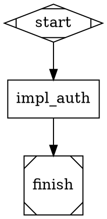

# CLAUDE.md — CoBuilder Package

This file provides guidance for Claude Code sessions working within the `cobuilder/` directory.

## Package Purpose

CoBuilder is the **pipeline execution engine** for multi-agent orchestration. It runs DOT-defined directed acyclic graph pipelines where each node dispatches an AgentSDK worker. The runner itself has zero LLM cost — all intelligence lives in the workers it dispatches.

**4-layer hierarchy:**
```
CoBuilder (Opus LLM)           — strategic planning, PRD authorship
    |
    Pilot (guardian.py)        — AUTONOMOUS goal-pursuing agent:
    |                            SD fidelity monitoring, Gherkin validation,
    |                            cross-node integration, pipeline E2E
    |
    pipeline_runner.py         — Python state machine, $0, <1s graph ops
    |                            Scoring enforcement, context injection
        |
        Workers                — AgentSDK: codergen, research, refine, validation
```

See `docs/sds/SD-PILOT-AUTONOMY-001.md` for the full pilot autonomy design.

## Module Map

### engine/ — Core Execution

| Module | Purpose |
|--------|---------|
| `pipeline_runner.py` | Main DOT pipeline state machine. Parses DOT, dispatches AgentSDK workers, watches signal files via watchdog, writes checkpoints, transitions node states. Zero LLM intelligence. |
| `guardian.py` | Layers 0/1 bridge. Launches Pilot agent processes via `ClaudeSDKClient` (`--dot` single or `--multi` parallel). Two modes: **continuous** (single conversation, Pilot polls for gates) and **event-driven** (`--event-driven`, multi-query pattern where Python layer sleeps on filesystem events between gates — zero LLM cost idle). Key components: `_GUARDIAN_TOOLS` (full file access), `_create_guardian_stop_hook()` (blocks exit when non-terminal nodes remain), `_run_agent_event_driven()` (multi-query loop using `gate_watch.async_watch()`). |
| `gate_watch.py` | Event-driven pipeline gate watcher. Blocks on filesystem events (via `watchdog`) until a `.gate-wait` marker, node failure, or pipeline completion signal appears. Returns structured JSON. CLI: `--signal-dir`, `--dot-file`, `--timeout`. Also provides `async_watch()` for `guardian.py` integration. |
| `session_runner.py` | Layer 2 monitoring runner. Monitors an orchestrator tmux session and communicates status via signal files. Supports both `--spawn` (fire-and-forget) and direct monitoring modes. |
| `cli.py` | Attractor CLI with full subcommand interface: `parse`, `validate`, `status`, `transition`, `checkpoint`, `generate`, `annotate`, `dashboard`, `node`, `edge`, `run`, `guardian`, `agents`, `merge-queue`. |
| `generate.py` | Generates Attractor-compatible `pipeline.dot` from beads task data. Reads `bd list --json` or a `--beads-json` file. |
| `dispatch_worker.py` | Shared utilities for AgentSDK worker dispatch: `compute_sd_hash()`, `load_engine_env()`, `create_signal_evidence()`, `load_agent_definition()`. |
| `dispatch_parser.py` | DOT file parsing utilities used by `pipeline_runner.py`. |
| `dispatch_checkpoint.py` | Saves pipeline checkpoints after each node transition. |
| `checkpoint.py` | Pydantic-based `EngineCheckpoint` and `CheckpointManager`. Atomic write-then-rename semantics. |
| `signal_protocol.py` | Atomic JSON signal file I/O. `write_signal()`, `read_signal()`, `list_signals()`, `wait_for_signal()`, `move_to_processed()`. |
| `providers.py` | LLM profile resolution. Reads `providers.yaml` and resolves 5-layer precedence to `ClaudeCodeOptions` at dispatch time. |
| `run_research.py` | Research node agent. Uses Context7 + Perplexity via Haiku SDK to validate implementation approaches against current docs. Updates the Solution Design file in-place. |
| `run_refine.py` | Refine node agent. Uses Sonnet to read research evidence JSON and rewrite SD sections with production-quality content. |
| `state_machine.py` | `RunnerStateMachine` — 7-mode state machine (INIT, RUNNER, MONITOR, WAIT_GUARDIAN, VALIDATE, COMPLETE, FAILED) used when `--dot-file` flag is active. |
| `transition.py` | Node status transition logic. Enforces `VALID_TRANSITIONS` and applies `apply_transition()`. |
| `spawn_orchestrator.py` | Spawns an orchestrator in a tmux session or via AgentSDK. Used by `CodergenHandler`. |
| `validator.py` | Pipeline topology and schema validator. |
| `parser.py` | Low-level DOT grammar parser. |
| `graph.py` | Graph traversal and dependency resolution. |
| `node_ops.py` | CRUD operations on DOT nodes. |
| `edge_ops.py` | CRUD operations on DOT edges. |
| `outcome.py` | `Outcome` and `OutcomeStatus` models (success, failed, partial_success). |
| `exceptions.py` | Domain exceptions: `HandlerError`, `CheckpointVersionError`, `CheckpointGraphMismatchError`. |
| `_env.py` | `_get_env()` helper with ATTRACTOR_ → PIPELINE_ deprecation warnings. |
| `.env` | LLM credentials. Loaded at runtime. Supports `$VAR` expansion. |

### engine/handlers/ — Node Handlers

Each handler receives a `HandlerRequest` (node definition + context) and returns an `Outcome`.

| Module | Shape | Handler | Purpose |
|--------|-------|---------|---------|
| `codergen.py` | `box` | `codergen` | LLM/orchestrator node. Dispatches via tmux (`spawn_orchestrator`) or AgentSDK (`sdk` strategy). Polls signal files for completion. Default timeout 3600s. |
| `planner.py` | `tab`, `note` | `planner` | Unified handler for planning-type nodes: research (`tab`), refine (`note`), and generic plan nodes. Configurable tool sets via `.cobuilder/tool-sets.yaml`. Renders prompts via `PromptRenderer`. Infers tool set from shape when `tool_set` attribute is absent (`tab`→research, `note`→refine). |
| `manager_loop.py` | `house` | `manager_loop` | Recursive sub-pipeline management. `spawn_pipeline` mode spawns child `pipeline_runner.py` subprocess and monitors it. Detects `GATE_WAIT_COBUILDER` and `GATE_WAIT_HUMAN` signals from child. Bounded by `PIPELINE_MAX_MANAGER_DEPTH` (default 5). |
| `wait_human.py` | `hexagon` | `wait.human` | Human gate. Polls for `INPUT_RESPONSE` signal and returns `WAITING` (no signal yet), `SUCCESS` (approve), or `FAILURE` (reject). Respects `PIPELINE_HUMAN_GATE_TIMEOUT` env var (default: indefinite). |
| `tool.py` | `parallelogram` | `tool` | Shell command execution via `subprocess.run(shell=True)` in `run_dir`. Captures stdout/stderr/exit_code into context. When `parse_json_output="true"`, parses JSON stdout and stores each key as `${node_id}.{key}`. Timeout: `PIPELINE_TOOL_TIMEOUT` env var (default 300s). |
| `conditional.py` | `diamond` | `conditional` | No-op routing node. Does not execute work itself — EdgeSelector handles all routing based on outgoing edge conditions. |
| `close.py` | `octagon` | `close` | Pipeline completion node. Handles programmatic epic closure (push, PR creation). |
| `parallel.py` | `component` | `parallel` | Fan-out parallel dispatch. |
| `fan_in.py` | `tripleoctagon` | `fan_in` | Merge parallel branches. |
| `start.py` | `Mdiamond` | `start` | Pipeline entry node. |
| `exit.py` | `Msquare` | `exit` | Early exit node. |
| `base.py` | — | — | `Handler` ABC and `HandlerRequest` dataclass. |
| `registry.py` | — | — | Handler registry — maps node shapes/handler attributes to handler classes. `HandlerRegistry.default()` wires all 12 standard shapes. |

### templates/ — Template System

| Module | Purpose |
|--------|---------|
| `instantiator.py` | Jinja2 DOT template renderer. Loads `template.dot.j2` + `manifest.yaml` from a template directory, validates parameters, renders, optionally runs constraint validation. Default templates dir: `.cobuilder/templates`. |
| `constraints.py` | Static constraint validation on rendered DOT output. |
| `manifest.py` | `Manifest` model and `load_manifest()` for `manifest.yaml` files. |

### repomap/ — Codebase Intelligence

Provides context injection for workers by building a semantic map of the codebase. Includes CLI, codegen, context filtering, evaluation, graph construction, LLM integration, ontology, RPG enrichment, sandbox, selection, Serena integration, spec parsing, and vector database modules.

## Conditions Package

The `engine/conditions/` sub-package provides the full expression language for edge routing.

### Syntax

| Construct | Examples |
|-----------|---------|
| Variable reference | `$node_id.field`, `$retry_count` |
| Dot-path access | `$run_ci.type`, `$node_visits.impl_auth` |
| Equality | `$status = "success"`, `$exit_code = 0` |
| Inequality | `$status != "failed"` |
| Ordering | `$retry_count < 3`, `$score >= 0.8` |
| Logical AND | `$a = "x" && $b = "y"` |
| Logical OR | `$a = "x" \|\| $b = "y"` |
| Negation | `!$flag` |
| Grouping | `($a = "x" \|\| $b = "y") && $c != "z"` |
| Boolean literals | `true`, `false` |
| Simple routing labels | `pass`, `fail`, `partial`, `success`, `error` |

### Variable Storage Convention

Variables are stored **with** the `$` prefix in the pipeline context:

```
context["$run_ci.type"] = "unit"
context["$retry_count"] = 2
context["$node_visits.impl_auth"] = 3
```

Access in conditions: `$run_ci.type = "unit"` or `$retry_count < 3`.

### Type Coercion

- **int ↔ float**: int is promoted to float
- **str ↔ number** (equality/ordering): string is parsed as number; raises `ConditionTypeError` if not numeric
- **bool + ordering operator** (`<`, `>`, `<=`, `>=`): raises `ConditionTypeError` — booleans only support `=` and `!=`
- **str ↔ str**: lexicographic comparison, no coercion

### Short-Circuit Evaluation

- `A && B`: if A is false, B is not evaluated
- `A || B`: if A is true, B is not evaluated

### Public API

```python
from cobuilder.engine.conditions import evaluate_condition, validate_condition_syntax

# Evaluate a condition
result = evaluate_condition("$retry_count < 3", context)  # → bool

# Validate syntax only (no evaluation)
errors, warnings = validate_condition_syntax("$bad = ")
```

---

## Edge Selection

`EdgeSelector` in `engine/edge_selector.py` implements a 5-step algorithm (highest priority first):

1. **Condition match** — evaluate each outgoing edge's `condition` against current pipeline context; first True edge wins
2. **Preferred label match** — if outcome has `preferred_label`, match edge with that `label`
3. **Suggested next node** — if outcome has `suggested_next`, match edge whose `target` equals it
4. **Weight-based selection** — pick the edge with the highest numeric `weight` attribute
5. **Default** — first unlabeled/unconditioned edge; or the first outgoing edge if all are labeled

The selector takes a snapshot of the pipeline context before evaluation so conditions see a stable view even in async execution.

---

## Conditional Routing Pattern

`conditional` (`diamond`) nodes are no-op — they do no work and write no output. All routing intelligence is in the edge conditions evaluated by `EdgeSelector`.

### N-Way Branch via Tool Output

A `tool` node can output structured JSON; a downstream `conditional` node routes based on those values:

```dot
run_ci [
    shape=parallelogram
    handler="tool"
    label="Run CI"
    tool_command="./scripts/ci.sh"
    parse_json_output="true"
    status=pending
];

route [
    shape=diamond
    handler="conditional"
    label="Route by test type"
    status=pending
];

unit_tests [shape=box handler="codergen" ...];
browser_tests [shape=box handler="codergen" ...];

run_ci -> route;
route -> unit_tests    [condition="$run_ci.type = \"unit\""    label="unit"];
route -> browser_tests [condition="$run_ci.type = \"browser\"" label="browser"];
```

The CI script writes `{"type": "unit"}` or `{"type": "browser"}` to stdout. With `parse_json_output="true"`, the runner stores `$run_ci.type` in the pipeline context. The `conditional` node then routes to the matching branch.

---

## Prompt Templatization

Nodes support Jinja2 prompt templates via `PromptRenderer` (in `engine/prompt_renderer.py`).

### Attributes

| Attribute | Description |
|-----------|-------------|
| `prompt_template` | Template name — loads `.cobuilder/prompts/<name>.j2` |
| `prompt_vars` | JSON dict string of extra variables available as `vars.*` in the template |
| `prompt` | Literal fallback when no template is configured or template fails to render |

### Resolution Order

1. `prompt_template` → render `.cobuilder/prompts/<name>.j2` with template variables
2. `prompt` → return literal string
3. `""` (empty string)

### Template Variables

Inside `.j2` files, the following variables are available:

```jinja2
{{ node_id }}          {# node ID string #}
{{ label }}            {# node label #}
{{ node.* }}           {# all node attributes via dot access #}
{{ context.* }}        {# pipeline context snapshot #}
{{ vars.* }}           {# extra vars from node's prompt_vars JSON #}
{{ timestamp }}        {# current UTC ISO-8601 timestamp #}
{{ run_dir }}          {# pipeline run directory path #}
{# All node.attrs keys are also injected as top-level variables #}
```

### Example

```dot
research_node [
    shape=tab
    handler="research"
    label="Research Auth Patterns"
    prompt_template="research-auth"
    prompt_vars="{\"focus\": \"OAuth2 PKCE\"}"
    status=pending
]
```

Template `.cobuilder/prompts/research-auth.j2`:
```jinja2
Research {{ vars.focus }} for {{ node_id }}.
Context: prd_ref={{ prd_ref }}, timestamp={{ timestamp }}.
```

---

## PlannerHandler

`PlannerHandler` (`engine/handlers/planner.py`) is the unified handler for `tab` (research), `note` (refine), and generic plan nodes. It replaced the previous pattern where these shapes were aliases to `CodergenHandler`.

### How It Works

1. Resolves the allowed tool set via 4-layer precedence (see Tool Sets below)
2. Renders the prompt via `PromptRenderer` (falls back to `node.prompt` if no template)
3. Dispatches via `claude_code_sdk.query()` with `allowed_tools` set to the resolved tool set
4. Writes evidence JSON to `{run_dir}/nodes/{node_id}/evidence.json`

### Node Attributes

| Attribute | Description |
|-----------|-------------|
| `tool_set` | Named tool set from `.cobuilder/tool-sets.yaml` (optional — inferred from shape if absent) |
| `prompt_template` | Jinja2 template name for prompt rendering |
| `prompt_vars` | JSON dict string of extra template variables |
| `prompt` | Literal prompt fallback |
| `system_prompt` | Custom system prompt (optional — defaults to generic planning prompt) |

---

## Tool Sets

Tool sets define the allowed Claude Code tools for `PlannerHandler` nodes. They are configured in `.cobuilder/tool-sets.yaml`.

### YAML Format

```yaml
my-set:
  description: "Human-readable description of what this set is for"
  tools:
    - Read
    - Edit
    - ToolSearch
    - mcp__context7__query-docs
```

### Pre-Defined Sets

| Set Name | Purpose | Key Tools |
|----------|---------|-----------|
| `research` | Full research: docs, web search, memory, code navigation | Bash, Read, Edit, Write, Context7, Perplexity (all), Hindsight, Serena |
| `refine` | Editing with memory and reasoning — no web research | Read, Edit, Write, Hindsight, Perplexity reason, Serena |
| `plan` | Read-only planning: code reading + memory + quick lookup | Read, Glob, Grep, Hindsight reflect/recall, Perplexity ask |
| `full` | Unrestricted general-purpose | Bash, Read, Edit, Write, ToolSearch, LSP, Glob, Grep |

### 4-Layer Tool Set Resolution (highest priority first)

1. **Node `tool_set` attribute** — explicit named set from YAML
2. **Shape inference** — `tab` → `research`, `note` → `refine`, other → `full`
3. **Hardcoded fallback** — built-in copy of the YAML sets (used when YAML is missing or unreadable)
4. **Empty** — if `yaml` is not importable and fallback is unreachable

---

## Key Patterns

### 1. Workers Communicate via Signal Files Only

Workers NEVER modify the DOT file. Only `pipeline_runner.py` writes to the DOT file.

Worker result format (written to `.pipelines/pipelines/signals/{pipeline_id}/{node_id}.json`):
```json
{
  "status": "success" | "failed",
  "files_changed": ["path/to/file"],
  "message": "Human-readable summary"
}
```

Validation result format (MANDATORY: `scores`, `overall_score`, `criteria_results` — runner rejects passes without them):
```json
{
  "result": "pass" | "fail" | "requeue",
  "reason": "Explanation",
  "scores": {"correctness": 9, "completeness": 8, "code_quality": 8, "sd_adherence": 9, "process_discipline": 8},
  "overall_score": 8.5,
  "criteria_results": [
    {"criterion_id": "AC-1", "status": "pass", "method": "api-call", "evidence": "..."},
    {"criterion_id": "AC-2", "status": "fail", "method": "browser-check", "reason": "..."}
  ],
  "requeue_target": "node_id_to_reset"
}
```

On `requeue`: runner sets `requeue_target` back to `pending` with structured feedback.

### 1b. Signal-Based Communication System

Nodes communicate via the signal directory:
- **Active**: `{signal_dir}/{node_id}.json` — runner watches, picks up, applies
- **Processed**: `{signal_dir}/processed/{timestamp}-{node_id}.json` — historical, nodes read for context
- **Score history**: `{signal_dir}/_score_history.json` — trends across retries

The runner injects signal history, graph neighborhood, SD fidelity, and cross-node integration context into every worker and validator prompt. See `_build_signal_history()`, `_build_graph_neighborhood()`, `_build_sd_fidelity_context()`, `_build_cross_node_context()`.

### 1c. Per-AC Validation Methods

Acceptance criteria support inline method tags:
```
AC-1 [browser-check]: Login form renders
AC-2 [api-call]: POST /auth/login returns JWT
AC-3 [unit-test]: Token TTL is configurable
```
Parsed by `_parse_acceptance_criteria()`. Validator prompt generates per-AC Gherkin with matching `@method` tags.

### 2. Status Chain

```
pending -> active -> impl_complete -> validated -> accepted
                  \-> failed
```

- `impl_complete`: worker AgentSDK call returned
- `validated`: validation agent confirmed technical correctness
- `accepted`: CoBuilder blind Gherkin E2E passed

### 3. LLM Profile Resolution (5-layer, first non-null wins)

1. Node's `llm_profile` attribute → look up in `providers.yaml`
2. `defaults.handler_defaults.{handler_type}.llm_profile` from pipeline manifest
3. `defaults.llm_profile` from pipeline manifest
4. Environment variables (`ANTHROPIC_MODEL`, `ANTHROPIC_API_KEY`, `ANTHROPIC_BASE_URL`)
5. Runner defaults (hardcoded: `claude-sonnet-4-5-20250514`, Anthropic API)

### 4. Environment / Credentials

`cobuilder/engine/.env` is loaded at runtime by `load_engine_env()`. It uses `export` syntax and supports `$VAR` expansion:

```bash
export ANTHROPIC_BASE_URL="https://coding-intl.dashscope.aliyuncs.com/apps/anthropic"
export DASHSCOPE_API_KEY=sk-...
export ANTHROPIC_API_KEY=$DASHSCOPE_API_KEY   # routes Anthropic calls through DashScope
export ANTHROPIC_MODEL="glm-5"
export PIPELINE_RATE_LIMIT_RETRIES=3
export PIPELINE_RATE_LIMIT_BACKOFF=65
```

The default LLM profile is `alibaba-glm5` (near-zero cost). Override per-node with `llm_profile="anthropic-smart"` etc.

### 5. Checkpoint / Resume

The runner writes a checkpoint JSON to `.pipelines/pipelines/` after each node transition. To resume a crashed run:

```bash
python3 cobuilder/engine/pipeline_runner.py --dot-file <path.dot> --resume
```

`CheckpointManager.load_or_create()` raises `CheckpointGraphMismatchError` if the DOT file has changed since the checkpoint.

### 6. Gate Handling

`wait.cobuilder` and `wait.human` nodes pause pipeline execution until a parent signal is received.

- `wait.cobuilder`: child writes `GATE_WAIT_COBUILDER` signal; parent (CoBuilder or `manager_loop`) runs validation agent and writes `GATE_RESPONSE`
- `wait.human`: child writes `GATE_WAIT_HUMAN` signal; parent calls `AskUserQuestion` and writes `GATE_RESPONSE`

Gate signals use `source="child"`, `target="parent"` naming convention.

## Common Commands

```bash
# Run a pipeline
python3 cobuilder/engine/pipeline_runner.py --dot-file .pipelines/pipelines/my-pipeline.dot

# Resume after crash
python3 cobuilder/engine/pipeline_runner.py --dot-file .pipelines/pipelines/my-pipeline.dot --resume

# Show node statuses
python3 cobuilder/engine/cli.py status .pipelines/pipelines/my-pipeline.dot

# Validate pipeline topology
python3 cobuilder/engine/cli.py validate .pipelines/pipelines/my-pipeline.dot

# Manual status transition (recovery)
python3 cobuilder/engine/cli.py transition .pipelines/pipelines/my-pipeline.dot <node_id> pending

# Save checkpoint manually
python3 cobuilder/engine/cli.py checkpoint save .pipelines/pipelines/my-pipeline.dot

# Dashboard view (stage, progress, nodes)
python3 cobuilder/engine/cli.py dashboard .pipelines/pipelines/my-pipeline.dot

# Generate pipeline from beads tasks
python3 cobuilder/engine/cli.py generate --prd PRD-MY-001 --output pipeline.dot

# Launch a guardian for a pipeline
python3 cobuilder/engine/guardian.py --dot .pipelines/pipelines/my-pipeline.dot --pipeline-id my-pipeline
```

## Testing

```bash
# CoBuilder engine unit tests
pytest tests/engine/ -v

# Attractor integration tests (signal protocol, guardian, runner, state machine)
pytest tests/attractor/ -v

# Run a specific test file
pytest tests/engine/test_manager_loop.py -v
pytest tests/attractor/test_signal_protocol.py -v

# All tests
pytest tests/ -v
```

Test directories:
- `tests/engine/` — Unit tests for engine modules (`test_close.py`, `test_logfire_spans.py`, `test_manager_loop.py`, `test_providers.py`, `test_state_machine.py`, `validation/`)
- `tests/attractor/` — Integration tests for the full attractor stack (guardian, runner, signal protocol, channel bridge, etc.)

## DOT Pipeline Format

Minimal working pipeline example:



Node attributes:
- `shape` — determines handler: `box`=codergen, `tab`=planner/research, `note`=planner/refine, `house`=manager_loop, `hexagon`=wait gate, `diamond`=conditional routing (no-op), `parallelogram`=tool, `component`=parallel, `tripleoctagon`=fan_in, `octagon`=close, `Mdiamond`=start, `Msquare`=exit
- `handler` — explicit handler override (e.g. `handler="wait.cobuilder"` vs `handler="wait.human"` both use `hexagon` shape)
- `status` — current status (default: `pending`)
- `llm_profile` — named profile from `providers.yaml`
- `worker_type` — AgentSDK subagent type to dispatch (codergen nodes only)
- `prompt` — literal instruction for the worker (fallback when no `prompt_template`)
- `prompt_template` — Jinja2 template name; loads `.cobuilder/prompts/<name>.j2`
- `prompt_vars` — JSON dict string of extra variables for prompt templates
- `tool_set` — named tool set from `.cobuilder/tool-sets.yaml` (planner nodes only)
- `solution_design` — path to SD file (inlined into worker prompt)
- `tool_command` — shell command to execute (tool nodes only)
- `parse_json_output` — `"true"` to parse JSON stdout into individual context keys (tool nodes)
- `bead_id` — associated beads issue ID

## Logfire Observability

Traces are emitted under these service names:
- `cobuilder-pipeline-runner` — pipeline runner spans (node dispatch, transitions, checkpoints)
- `cobuilder-guardian` — Pilot agent spans
- `cobuilder-session-runner` — session runner spans

Use `mcp__logfire-mcp__arbitrary_query` with `service.name = 'cobuilder-pipeline-runner'` to filter traces.
